

# **Universidad Peruana de Ciencias Aplicadas**

### **Informe de Trabajo Final**

**Carrera**: Ingeniería de Software

**Curso**: Desarrollo de Aplicaciones Open Source

**Sección**: 1ASI0729-2610-10155

**Profesor**: Hugo Allan Mori Paiva

**Ciclo**: 2026-1

**Startup:** SmartNeighbor

**Nombre del Producto**: RouteStock

**Integrantes**:

Luis Angel Cisneros Salas (U20211B198)
 Luis German Tello Quispe (U202317767)
 Alison Arrieta (U202312031)
 Alfaro Coveñas, Louis Piero (u20191b299)

**Abril del 2026**

**Contenido**  
[Contenido	4](#contenido)

[Registro de Versiones del Informe	4](#registro-de-versiones-del-informe)

[Project Report Collaboration Insights	4](#project-report-collaboration-insights)

[Contenido	4](#contenido-1)

[Student Outcome	4](#student-outcome)

[1\.	Capítulo I: Introducción	4](#capítulo-i:-introducción)

[1.1	Startup Profile	4](#startup-profile)

[1.1.1	Descripción de la Startup	4](#descripción-de-la-startup)

[1.1.2	Perfiles de integrantes del equipo	4](#perfiles-de-integrantes-del-equipo)

[1.2	Solution Profile	4](#solution-profile)

[1.2.1	Antecedentes y problemática	4](#antecedentes-y-problemática)

[1.2.2	Lean UX Process	4](#lean-ux-process)

[1.3	Segmentos objetivo	4](#segmentos-objetivo)

[2\.	Capítulo II: Requirements Elicitation & Analysis	4](#capítulo-ii:-requirements-elicitation-&-analysis)

[2.1	Competidores	4](#competidores)

[2.1.1	Análisis competitivo	4](#análisis-competitivo)

[2.1.2	Estrategias y tácticas frente a competidores	4](#estrategias-y-tácticas-frente-a-competidores)

[2.2	Entrevistas	5](#entrevistas)

[2.2.1	Diseño de entrevistas	5](#diseño-de-entrevistas)

[2.2.2	Registro de entrevistas	5](#registro-de-entrevistas)

[2.2.3	Análisis de entrevistas	5](#análisis-de-entrevistas)

[2.3	Needfinding	5](#needfinding)

[2.3.1	User Personas	5](#user-personas)

[2.3.2	User Task Matrix	5](#user-task-matrix)

[2.3.3	User Journey Mapping	5](#user-journey-mapping)

[2.3.4	Empathy Mapping	5](#empathy-mapping)

[2.4	Big Picture Event Storming	5](#big-picture-event-storming)

[2.5	Ubiquitous Language	5](#ubiquitous-language)

[3\.	Capítulo III: Requirements Specification	5](#capítulo-iii:-requirements-specification)

[3.1	User Stories	5](#user-stories)

[3.2	Impact Mapping	5](#impact-mapping)

[3.3	Product Backlog	5](#product-backlog)

[4\.	Capítulo IV: Product Design	5](#capítulo-iv:-product-design)

[4.1	Style Guidelines	5](#style-guidelines)

[4.1.1	General Style Guidelines	5](#general-style-guidelines)

[4.1.2	Web Style Guidelines	5](#web-style-guidelines)

[4.2	Information Architecture	5](#information-architecture)

[4.2.1	Organization Systems	5](#organization-systems)

[4.2.2	Labeling Systems	5](#labeling-systems)

[4.2.3	SEO Tags and Meta Tags	5](#seo-tags-and-meta-tags)

[4.2.4	Searching Systems	6](#searching-systems)

[4.2.5	Navigation Systems	6](#navigation-systems)

[4.3	Landing Page UI Design	6](#landing-page-ui-design)

[4.3.1	Landing Page Wireframe	6](#landing-page-wireframe)

[4.3.2	Landing Page Mock-up	6](#landing-page-mock-up)

[4.4	Web Applications UX/UI Design	6](#web-applications-ux/ui-design)

[4.4.1	Web Applications Wireframes	6](#web-applications-wireframes)

[4.4.2	Web Applications Wireflow Diagrams	6](#web-applications-wireflow-diagrams)

[4.4.3	Web Applications Mock-ups	6](#web-applications-mock-ups)

[4.4.4	Web Applications User Flow Diagrams	6](#web-applications-user-flow-diagrams)

[4.5	Web Applications Prototyping	6](#web-applications-prototyping)

[4.6	Domain-Driven Software Architecture	6](#domain-driven-software-architecture)

[4.6.1	Design-Level Event Storming	6](#design-level-event-storming)

[4.6.2	Software Architecture Context Diagram	6](#software-architecture-context-diagram)

[4.6.3	Software Architecture Container Diagrams	6](#software-architecture-container-diagrams)

[4.6.4	Software Architecture Component Diagrams	6](#software-architecture-component-diagrams)

[4.7	Software Object-Oriented Design	6](#software-object-oriented-design)

[4.7.1	Class Diagrams	6](#class-diagrams)

[4.8	Database Design	6](#database-design)

[4.8.1	Database Diagrams	6](#database-diagrams)

[5\.	Capítulo V: Product Implementation, Validation & Deployment	6](#capítulo-v:-product-implementation,-validation-&-deployment)

[5.1	Software Configuration Management	6](#software-configuration-management)

[5.1.1	Software Development Environment Configuration	6](#software-development-environment-configuration)

[5.1.2	Source Code Management	6](#source-code-management)

[5.1.3	Source Code Style Guide & Conventions	7](#source-code-style-guide-&-conventions)

[5.1.4	Software Deployment Configuration	7](#software-deployment-configuration)

[5.2	Landing Page, Services & Applications Implementation	7](#landing-page,-services-&-applications-implementation)

[5.3	Validation Interviews	7](#validation-interviews)

[5.3.1	Diseño de Entrevistas	7](#diseño-de-entrevistas-1)

[5.3.2	Registro de Entrevistas	7](#registro-de-entrevistas-1)

[5.3.3	Evaluaciones según heurísticas	7](#evaluaciones-según-heurísticas)

[5.4	Video About-the-Product	7](#video-about-the-product)

[Conclusiones	7](#conclusiones)

[Bibliografía	7](#bibliografía)

[Anexos	7](#anexos)

# **Contenido** {#contenido}

# **Registro de Versiones del Informe** {#registro-de-versiones-del-informe}

# **Project Report Collaboration Insights** {#project-report-collaboration-insights}

# **Contenido** {#contenido-1}

# **Student Outcome** {#student-outcome}

1. # **Capítulo I: Introducción** {#capítulo-i:-introducción}

   1. ## **Startup Profile** {#startup-profile}

      1. ### **Descripción de la Startup** {#descripción-de-la-startup}

      2. ### **Perfiles de integrantes del equipo** {#perfiles-de-integrantes-del-equipo}

   2. ## **Solution Profile** {#solution-profile}

      1. ### **Antecedentes y problemática** {#antecedentes-y-problemática}

      2. ### **Lean UX Process** {#lean-ux-process}

         1. #### ***Lean UX Problem Statements***

         2. #### ***Lean UX Assumptions***

         3. #### ***Lean UX Hypothesis Statements***

         4. #### ***Lean UX Canvas***

   3. ## **Segmentos objetivo** {#segmentos-objetivo}

# Capítulo II: Requirements Elicitation & Analysis

## 2.1 Competidores

### 2.1.1 Análisis competitivo

El análisis competitivo tiene como objetivo identificar las principales soluciones digitales existentes en el mercado que abordan, de manera parcial o total, las necesidades que RouteStock busca resolver: la búsqueda de productos cercanos y la digitalización de pequeños comercios.

---

#### Competitive Analysis Landscape

**¿Por qué llevar a cabo este análisis?**

Es necesario realizar este análisis para identificar las soluciones digitales que compiten con RouteStock, comprender sus fortalezas y debilidades, y definir estrategias que permitan posicionarse de forma diferenciada en el mercado peruano.

| | **RouteStock** | **Rappi** | **Glovo** | **Google Maps / Negocios en Google** |
|---|---|---|---|---|
| **PERFIL** | | | | |
| Overview | Plataforma digital que conecta a usuarios con bodegas, comercios locales y vendedores ambulantes cercanos, facilitando la búsqueda de productos por geolocalización. | Plataforma de delivery consolidada en Latinoamérica con enfoque en grandes cadenas de restaurantes, supermercados y tiendas. | Plataforma de delivery presente en Lima con modelo similar a Rappi; prioriza velocidad de entrega. | Motor de búsqueda y mapas que permite a negocios registrarse para ser encontrados por usuarios cercanos. |
| Ventaja Competitiva | Integración única de bodegas, comercios informales y vendedores ambulantes con búsqueda por producto y optimización de rutas de delivery. | Red masiva de repartidores y amplia variedad de comercios formales; rapidez de entrega. | Amplia cobertura geográfica en Lima y modelo flexible que abarca múltiples categorías. | Gratuito, ampliamente conocido y con función de geolocalización precisa para descubrir negocios cercanos. |
| **PERFIL DE MARKETING** | | | | |
| Mercado Objetivo | Dueños de bodegas, comercios locales y vendedores ambulantes; consumidores urbanos de Lima que buscan productos de cercanía. | Consumidores urbanos con acceso a smartphone que buscan delivery rápido de alimentos y productos de grandes marcas. | Consumidores urbanos que buscan envíos rápidos y variados desde múltiples tipos de comercios. | Negocios de todo tipo que desean visibilidad digital; usuarios que buscan locales o servicios cercanos. |
| Estrategias de Marketing | Enfoque en comunidades locales, alianzas con asociaciones de comerciantes y marketing digital en zonas urbanas de Lima. | Publicidad masiva en redes sociales, descuentos y promociones agresivas; programas de fidelización. | Campañas digitales con énfasis en velocidad de entrega y diversidad de opciones disponibles. | Posicionamiento orgánico (SEO) y herramientas gratuitas para negocios; integración con el ecosistema Google. |
| **PERFIL DEL PRODUCTO** | | | | |
| Productos & Servicios | Registro de inventario para micronegocios, búsqueda de productos por ubicación, integración de vendedores ambulantes y optimización de rutas de delivery. | Delivery de alimentos, supermercado virtual, farmacia, tiendas de conveniencia y envíos expresos. | Delivery de comida, supermercados, farmacias y envíos de cualquier tipo de paquete. | Registro de negocios, mapas interactivos, reseñas, horarios y geolocalización; sin gestión de inventario. |
| Precios & Costos | Acceso gratuito para comercios durante lanzamiento; posibles planes premium; costo de delivery variable para consumidores. | Comisiones elevadas para comercios (15-30%); costo de delivery para el usuario; suscripción Rappi Prime. | Comisiones por cada pedido para comercios; costo de envío al usuario; opción de suscripción Glovo Prime. | Gratuito para negocios y usuarios; Google Ads como modelo de monetización opcional. |
| Canales de distribución | Aplicación móvil y plataforma web; accesible desde cualquier dispositivo con internet. | App móvil (iOS y Android) y web; disponible en Lima y principales ciudades de Latinoamérica. | App móvil (iOS y Android) y web; presente en Lima y otras ciudades de Perú. | App móvil (iOS y Android), web y extensión de navegador; integrado con otros servicios de Google. |
| **ANÁLISIS SWOT** | | | | |
| Fortalezas | Enfoque exclusivo en micronegocios y comercio informal; propuesta inclusiva y accesible; optimización de rutas. | Gran base de usuarios; marca reconocida; red logística consolidada; variedad de categorías. | Amplia cobertura en Lima; modelo flexible; velocidad de entrega; diversidad de comercios. | Gratuito; ampliamente adoptado; integración con Google Maps y reseñas; alta visibilidad. |
| Debilidades | Plataforma nueva sin base de usuarios establecida; requiere adopción tecnológica de comerciantes informales. | No incluye bodegas ni vendedores ambulantes; comisiones altas para pequeños negocios. | No integra micronegocios informales; sin gestión de inventario para comercios locales. | No permite búsqueda por producto específico ni muestra inventario disponible en tiempo real. |
| Oportunidades | Alta informalidad comercial en Lima; creciente demanda de digitalización en micronegocios; mercado poco atendido. | Expansión hacia micronegocios y comercio informal; alianzas con bodegas y mercados locales. | Incorporar comercios informales; desarrollar funciones de inventario; ampliar cobertura en distritos periféricos. | Integrar visualización de inventario y disponibilidad de productos; alianzas con comercios locales. |
| Amenazas | Competencia de plataformas ya establecidas; resistencia de comerciantes a adoptar tecnología; baja conectividad en algunas zonas. | Entrada de nuevos competidores locales; regulación de delivery; aumento de costos logísticos. | Competencia creciente con Rappi y plataformas locales; regulación del delivery en Perú. | Plataformas especializadas que ofrezcan búsqueda de productos por ubicación con mayor detalle. |

---

### 2.1.2 Estrategias y tácticas frente a competidores

A partir del análisis competitivo, se han identificado las principales estrategias y tácticas que RouteStock puede aplicar para posicionarse frente a sus competidores:

**Estrategia 1: Diferenciación por inclusión de micronegocios**
- Diseñar un proceso de registro sencillo y gratuito para bodegas, comercios locales y vendedores ambulantes, con soporte técnico accesible.
- Permitir el registro de productos sin necesidad de conocimientos tecnológicos avanzados, con formularios guiados y carga de fotos desde el celular.

**Estrategia 2: Posicionamiento en zonas urbanas no atendidas**
- Enfocarse inicialmente en distritos de Lima Metropolitana con alta densidad de bodegas y bajo nivel de digitalización.
- Establecer alianzas con asociaciones de comerciantes locales para facilitar la adopción de la plataforma.

**Estrategia 3: Modelo de acceso asequible**
- Ofrecer acceso gratuito a los comercios durante la fase de lanzamiento, con planes premium opcionales a futuro.
- Mantener sin costo el uso de la plataforma para los consumidores, generando ingresos a través de comisiones en delivery y publicidad segmentada.

**Estrategia 4: Innovación en búsqueda por geolocalización e inventario**
- Desarrollar un motor de búsqueda por producto que muestre resultados según la ubicación del usuario en tiempo real.
- Implementar alertas de disponibilidad y notificaciones cuando un producto buscado esté disponible cerca del usuario.

---

## 2.2 Entrevistas

### 2.2.1 Diseño de entrevistas

El diseño de entrevistas fue orientado a recopilar información de los dos segmentos objetivo identificados: los dueños de bodegas, comercios locales y vendedores ambulantes; y los consumidores o usuarios finales. El objetivo es comprender sus necesidades, frustraciones y expectativas respecto al uso de plataformas digitales para la búsqueda y oferta de productos.

**Segmento 1: Dueños de bodegas, comercios locales y vendedores ambulantes**
- ¿Cómo gestiona actualmente el inventario de su negocio?
- ¿Utiliza alguna herramienta digital para mostrar sus productos o recibir pedidos?
- ¿Qué dificultades enfrenta para atraer nuevos clientes?
- ¿Estaría dispuesto a registrar sus productos en una plataforma digital? ¿Qué condiciones serían necesarias?
- ¿Qué tan cómodo se siente con el uso de aplicaciones móviles o plataformas en línea?
- ¿Cuáles son sus principales preocupaciones respecto a digitalizar su negocio?

**Segmento 2: Consumidores o usuarios finales**
- ¿Con qué frecuencia necesita encontrar un producto de manera urgente cerca de su ubicación?
- ¿Qué hace actualmente cuando necesita un producto y no sabe dónde conseguirlo cerca?
- ¿Ha usado alguna aplicación para buscar productos en su zona? ¿Cuál fue su experiencia?
- ¿Qué información le gustaría encontrar al buscar un producto cercano (precio, disponibilidad, horario, etc.)?
- ¿Qué tan importante es para usted la posibilidad de recibir el producto mediante delivery?
- ¿Confiaría en una plataforma que muestre el inventario de bodegas y pequeños comercios cercanos?

---

### 2.2.2 Registro de entrevistas

#### Segmento 1: Dueños de bodegas, comercios locales y vendedores ambulantes

**Entrevistado N°1: Javier Silva**

| Campo | Detalle |
|---|---|
| Entrevistado N°1: Javier Silva | 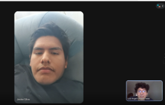 |
| Nombre | Javier Silva |
| Edad | 30 |
| Sexo | Masculino |
| Ocupación | Dueño de bodega |
| Momento de inicio | 0:02 |
| Momento de fin | 3:28 |

**Entrevistado N°2: Sebastian Peralta**

| Campo | Detalle |
|---|---|
| Entrevistado N°2: Sebastian Peralta |  |
| Nombre | Sebastian Peralta |
| Edad | 27 |
| Sexo | Masculino |
| Ocupación | Dueño de bodega |
| Momento de inicio | 0:02 |
| Momento de fin | 6:28 |

---

#### Segmento 2: Consumidores o usuarios finales

**Entrevistado N°1: Luis Perez**

| Campo | Detalle |
|---|---|
| Entrevistado N°2:Luis Perez | 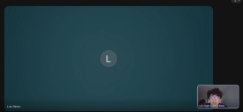 |
| Nombre | Luis Perez |
| Edad | 24 |
| Sexo | Masculino |
| Ocupación | Consumidor |
| Momento de inicio | 0:02 |
| Momento de fin | 2:11 |

**Entrevistado N°2: Isaac Alvis**

| Campo | Detalle |
|---|---|
| Entrevistado N°2: Isaac Alvis | 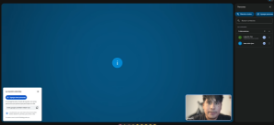 |
| Nombre | Isaac Alvis |
| Edad | 24 |
| Sexo | Masculino |
| Ocupación | Consumidor |
| Momento de inicio | 0:01 |
| Momento de fin | 4:26 |

**Entrevistado N°3: Erick Calderon**

| Campo | Detalle |
|---|---|
| Entrevistado N°2: Erick Calderon |  |
| Nombre | Erick Calderon |
| Edad | 23 |
| Sexo | Masculino |
| Ocupación | Consumidor |
| Momento de inicio | 0:01 |
| Momento de fin | 3:30 |

---

### 2.2.3 Análisis de entrevistas

#### Análisis sobre Dueños de bodegas, comercios locales y vendedores ambulantes

| Entrevistado | Análisis |
|---|---|
| Javier Silva | El entrevistado gestiona su inventario de forma manual en un cuaderno, lo que le genera problemas de desabastecimiento. No utiliza herramientas digitales para mostrar sus productos; su único canal es WhatsApp para pedidos esporádicos. Su clientela es principalmente del barrio y le cuesta llegar a nuevos clientes por falta de visibilidad digital. Mostró interés en registrarse en una plataforma digital siempre que sea fácil de usar y sin costo elevado al inicio. Usa el celular básicamente para llamadas y WhatsApp, pero estaría dispuesto a aprender si la herramienta es sencilla. Sus principales preocupaciones son no saber manejar la tecnología correctamente y la seguridad de sus datos. |
| Sebastian Peralta | El entrevistado actualmente administra su inventario de forma básica utilizando Excel. Sin embargo, no emplea ninguna herramienta digital para exhibir sus productos, lo que limita significativamente su crecimiento y alcance. Debido a esta falta de presencia en internet, su clientela se reduce exclusivamente a los vecinos del barrio donde se ubica su local, haciendo muy difícil atraer nuevos compradores. A pesar de esto, mostró un claro interés en registrarse en una plataforma digital para ganar visibilidad, siempre y cuando sea una herramienta intuitiva, fácil de usar y que no represente un costo inicial elevado. |

#### Análisis sobre Consumidores o usuarios finales

| Entrevistado | Análisis |
|---|---|
| Luis Perez | El entrevistado busca productos cercanos con frecuencia, aproximadamente dos o tres veces por semana. Cuando no sabe dónde conseguirlos, recorre las bodegas del barrio una por una o consulta a vecinos. Ha usado Rappi y Glovo, pero señaló que solo muestran grandes tiendas y que el costo de delivery es elevado para compras pequeñas. La información que más le interesa al buscar un producto es el precio, disponibilidad en tiempo real, horario del negocio y distancia desde su ubicación. Considera el delivery importante, especialmente cuando no tiene tiempo de salir, siempre que el costo sea razonable. Confiaría en una plataforma de bodegas cercanas si la información está actualizada y los negocios cuentan con reseñas verificadas. |
| Isaac Alvis | El entrevistado busca productos cerca de su domicilio con regularidad, unas dos o tres veces por semana. Si no sabe dónde encontrarlos, va a las tiendas de barrio una por una o pregunta a los vecinos. Ha usado Glovo y Rappi, pero señaló que solo incluyen tiendas grandes y que el servicio de entrega es caro para compras pequeñas. Al buscar un producto, lo que más le interesa es el precio, la disponibilidad en tiempo real, el horario de atención y la distancia a su ubicación. Destaca que la entrega es importante, sobre todo cuando no tiene tiempo para salir, siempre y cuando el precio sea razonable. Si la información está actualizada y los negocios tienen reseñas verificadas, confiaría en una plataforma de tiendas cercanas. |
| Erick Calderon | El entrevistado mostró interés en la app RouteStock principalmente porque la percibe como una herramienta accesible para todo tipo de usuarios. Destacó que su mayor valor está en la posibilidad de encontrar bodegas cercanas de manera rápida y sencilla, lo que le facilitaría resolver necesidades urgentes sin perder tiempo buscando. Además, considera que una app así podría ser muy útil en el día a día, especialmente si ofrece información clara sobre ubicación y disponibilidad de productos. |

---

## 2.3 Needfinding

### 2.3.1 User Personas

A partir del análisis de las entrevistas y la investigación de los segmentos objetivo, se construyeron dos User Personas representativas de los principales usuarios de RouteStock.

> **Segmento 1** 

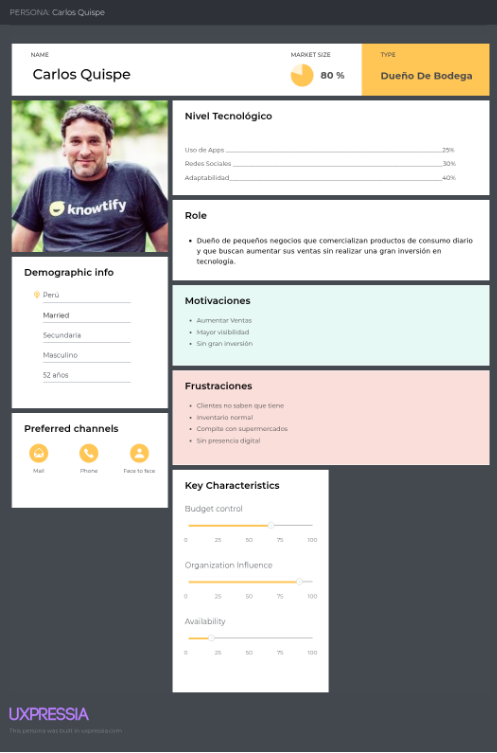

> **Segmento 2** 

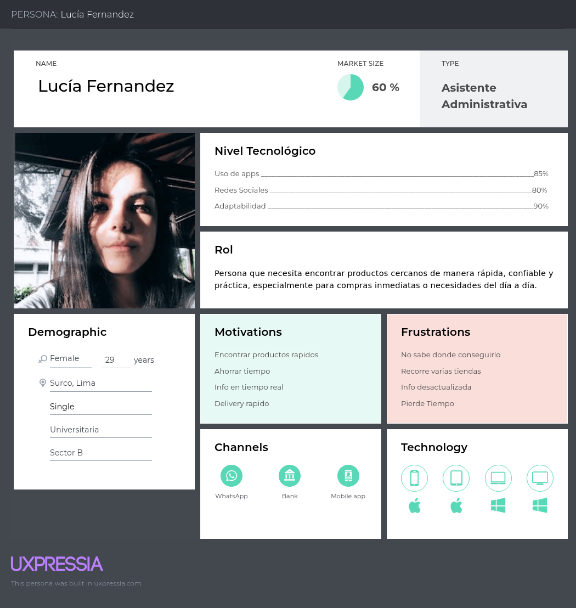

Links de los dos: [User Personas](https://uxpressia.com/w/we6iw/p/6UqRM?tagId=Aldi9)

### 2.3.2 User Task Matrix

A partir del análisis de la User Task Matrix de RouteStock, se identificaron las tareas de mayor frecuencia e importancia para cada segmento. En el caso del Segmento 1 (Comerciantes), las tareas críticas son el registro y actualización del inventario, la gestión de la visibilidad del negocio y la recepción de notificaciones de pedidos, todas clasificadas con frecuencia e importancia alta. Para el Segmento 2 (Consumidores), las tareas prioritarias son la búsqueda de productos por cercanía, la comparación de disponibilidad entre comercios y la solicitud de delivery. Entre las tareas compartidas, el registro en la plataforma y el contacto entre usuarios destacan como acciones de alta importancia para ambos segmentos.

| Tarea | S1 Frecuencia | S1 Importancia | S1 Prioridad | S2 Frecuencia | S2 Importancia | S2 Prioridad |
|---|---|---|---|---|---|---|
| **Gestión del negocio** | | | | | | |
| Registrar productos en la plataforma | Alta | Alta | ⭐⭐⭐ | N/A | N/A | — |
| Actualizar inventario cuando hay cambios | Alta | Alta | ⭐⭐⭐ | N/A | N/A | — |
| Gestionar visibilidad del negocio | Media | Alta | ⭐⭐⭐ | N/A | N/A | — |
| Recibir notificaciones de pedidos | Media | Alta | ⭐⭐⭐ | N/A | N/A | — |
| Coordinar opciones de delivery / recojo | Media | Media | ⭐⭐⭐ | N/A | N/A | — |
| Revisar estadísticas de visitas al perfil | Baja | Media | ⭐⭐⭐ | N/A | N/A | — |
| **Búsqueda y compra de productos** | | | | | | |
| Buscar un producto cerca de su ubicación | N/A | N/A | — | Alta | Alta | ⭐⭐⭐ |
| Comparar disponibilidad entre comercios | N/A | N/A | — | Media | Alta | ⭐⭐⭐ |
| Solicitar delivery de un producto | N/A | N/A | — | Media | Alta | ⭐⭐⭐ |
| Consultar horarios de atención | N/A | N/A | — | Media | Media | ⭐⭐⭐ |
| Guardar comercios o productos favoritos | N/A | N/A | — | Baja | Media | ⭐⭐⭐ |
| Recibir alertas de disponibilidad | N/A | N/A | — | Baja | Media | ⭐⭐⭐ |
| **Tareas compartidas** | | | | | | |
| Registrarse / crear perfil en la plataforma | Baja | Alta | ⭐⭐⭐ | Baja | Alta | ⭐⭐⭐ |
| Contactar al otro usuario (chat / pedido) | Media | Alta | ⭐⭐⭐ | Media | Alta | ⭐⭐⭐ |
| Calificar / dejar reseña | Baja | Media | ⭐⭐⭐ | Baja | Media | ⭐⭐⭐ |

---

### 2.3.3 User Journey Mapping

> **Segmento 1: Dueño de Bodega** 

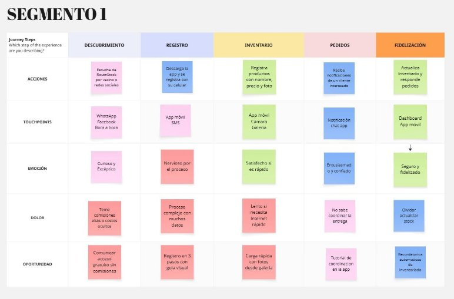

> **Segmento 2: Consumidora Urbana** 

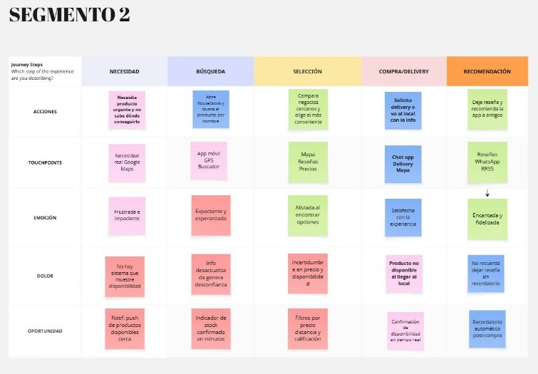

Link Miro: [Segmentos](https://miro.com/app/board/uXjVGh_xhSc=/?share_link_id=823723323948)

---

### 2.3.4 Empathy Mapping

> **Segmento 1** 

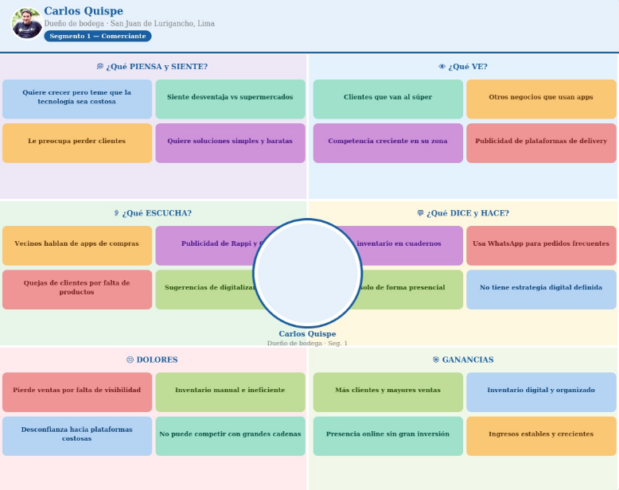

> **Segmento 2** 

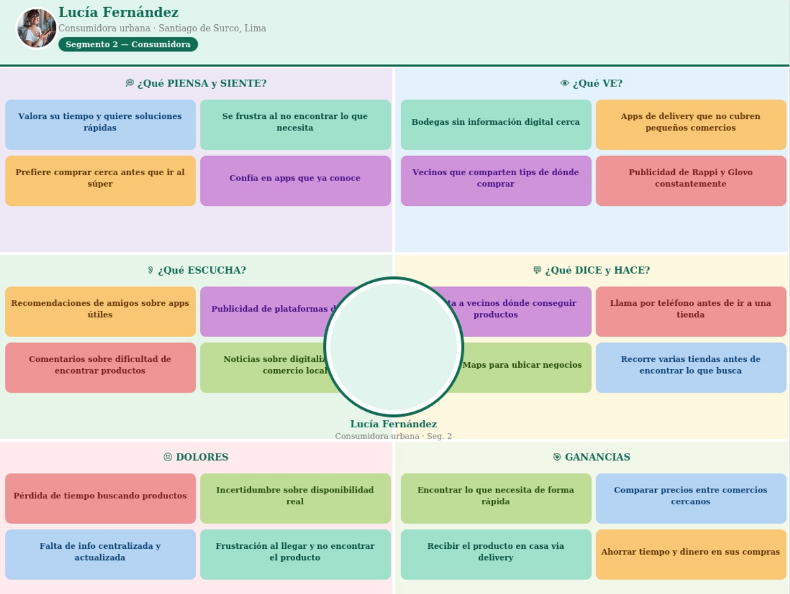

---

## 2.4 Big Picture Event Storming

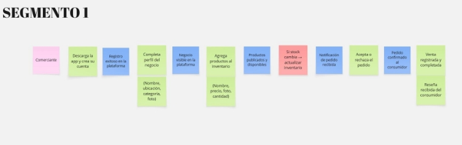

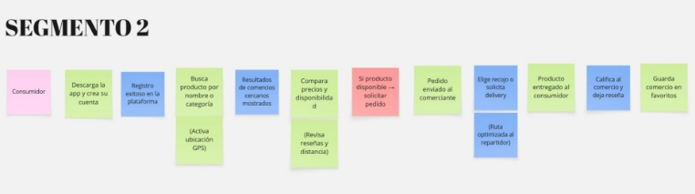

**Segmento 1 — Comerciante (Carlos Quispe)**

El flujo del comerciante comienza cuando descarga la app y crea su cuenta, completando el perfil de su negocio con datos como nombre, ubicación y categoría, lo que lo hace visible dentro de la plataforma. A partir de ahí, registra sus productos con precio, foto y cantidad disponible, publicándolos para que los consumidores puedan encontrarlos. Una política clave del sistema es que cada vez que el stock cambia, se activa la actualización del inventario para mantener la información confiable. Cuando un consumidor realiza un pedido, el comerciante recibe una notificación y decide aceptarlo o rechazarlo. Si lo acepta, el pedido se confirma y, una vez completada la venta, queda registrada en el sistema junto con la posible reseña del consumidor.

**Segmento 2 — Consumidora (Lucía Fernández)**

El flujo de la consumidora arranca con la descarga de la app y la creación de su cuenta. Al tener una necesidad inmediata, busca un producto por nombre o categoría activando su ubicación GPS, lo que le muestra los comercios cercanos con disponibilidad en tiempo real. Desde ahí compara precios, distancia y reseñas antes de tomar una decisión. Cuando encuentra el producto, el sistema aplica una política: si está disponible, puede solicitar el pedido directamente. Luego elige entre recogerlo en el local o solicitar delivery con ruta optimizada. Una vez recibido el producto, el sistema le envía un recordatorio para calificar al comercio y guardar el negocio en favoritos, cerrando así el ciclo de compra.

---

## 2.5 Ubiquitous Language

| Término | Definición |
|---|---|
| **Bodega / Comercio Local** | Establecimiento físico de pequeña escala que ofrece productos de consumo diario a consumidores de su entorno cercano. |
| **Vendedor Ambulante** | Comerciante sin local fijo que ofrece productos de forma móvil dentro de una zona urbana registrada en la plataforma. |
| **Comerciante** | Persona dueña o encargada de una bodega, comercio local o puesto ambulante registrado en RouteStock. |
| **Consumidor** | Usuario final que utiliza la plataforma para buscar y adquirir productos en comercios cercanos a su ubicación. |
| **Inventario** | Conjunto de productos registrados por un comerciante, con su disponibilidad y precio actualizados en la plataforma. |
| **Producto** | Artículo registrado dentro del inventario de un comercio, visible y buscable por los consumidores. |
| **Búsqueda por Cercanía** | Funcionalidad que permite al consumidor encontrar productos disponibles en comercios próximos a su ubicación en tiempo real. |
| **Pedido** | Solicitud realizada por un consumidor para adquirir uno o más productos de un comercio registrado. |
| **Ruta de Entrega** | Camino optimizado calculado por la plataforma para transportar un pedido desde el comercio hasta el consumidor de forma eficiente. |
| **Disponibilidad** | Estado que indica si un producto se encuentra disponible o agotado en el inventario de un comercio. |
| **Calificación** | Valoración de 1 a 5 estrellas que un consumidor asigna a un comercio tras realizar una compra. |
| **Perfil** | Información registrada por un usuario —comerciante o consumidor— en la plataforma, incluyendo datos de contacto y preferencias. |
| **Digitalización** | Proceso mediante el cual un comercio local registra su negocio e inventario en RouteStock para aumentar su visibilidad y alcance comercial. |
| **Ubicación** | Coordenadas geográficas de un comercio o consumidor, usadas para determinar proximidad y calcular rutas de entrega. |
| **Plataforma Digital** | Entorno digital donde comerciantes y consumidores interactúan para la búsqueda, oferta y adquisición de productos locales. |

3. # **Capítulo III: Requirements Specification** {#capítulo-iii:-requirements-specification}

   1. ## **User Stories** {#user-stories}

   2. ## **Impact Mapping** {#impact-mapping}

   3. ## **Product Backlog** {#product-backlog}

4. # **Capítulo IV: Product Design** {#capítulo-iv:-product-design}

   1. ## **Style Guidelines** {#style-guidelines}

      1. ### **General Style Guidelines** {#general-style-guidelines}

      2. ### **Web Style Guidelines** {#web-style-guidelines}

   2. ## **Information Architecture** {#information-architecture}

      1. ### **Organization Systems** {#organization-systems}

      2. ### **Labeling Systems** {#labeling-systems}

      3. ### **SEO Tags and Meta Tags** {#seo-tags-and-meta-tags}

      4. ### **Searching Systems** {#searching-systems}

      5. ### **Navigation Systems** {#navigation-systems}

   3. ## **Landing Page UI Design** {#landing-page-ui-design}

      1. ### **Landing Page Wireframe** {#landing-page-wireframe}

      2. ### **Landing Page Mock-up** {#landing-page-mock-up}

   4. ## **Web Applications UX/UI Design** {#web-applications-ux/ui-design}

      1. ### **Web Applications Wireframes** {#web-applications-wireframes}

      2. ### **Web Applications Wireflow Diagrams** {#web-applications-wireflow-diagrams}

      3. ### **Web Applications Mock-ups** {#web-applications-mock-ups}

      4. ### **Web Applications User Flow Diagrams** {#web-applications-user-flow-diagrams}

   5. ## **Web Applications Prototyping** {#web-applications-prototyping}

   6. ## **Domain-Driven Software Architecture** {#domain-driven-software-architecture}

      1. ### **Design-Level Event Storming** {#design-level-event-storming}

      2. ### **Software Architecture Context Diagram** {#software-architecture-context-diagram}

      3. ### **Software Architecture Container Diagrams** {#software-architecture-container-diagrams}

      4. ### **Software Architecture Component Diagrams** {#software-architecture-component-diagrams}

   7. ## **Software Object-Oriented Design** {#software-object-oriented-design}

      1. ### **Class Diagrams** {#class-diagrams}

   8. ## **Database Design** {#database-design}

      1. ### **Database Diagrams** {#database-diagrams}

5. # **Capítulo V: Product Implementation, Validation & Deployment** {#capítulo-v:-product-implementation,-validation-&-deployment}

   1. ## **Software Configuration Management** {#software-configuration-management}

      1. ### **Software Development Environment Configuration** {#software-development-environment-configuration}

      2. ### **Source Code Management** {#source-code-management}

      3. ### **Source Code Style Guide & Conventions** {#source-code-style-guide-&-conventions}

      4. ### **Software Deployment Configuration** {#software-deployment-configuration}

   2. ## **Landing Page, Services & Applications Implementation** {#landing-page,-services-&-applications-implementation}

   3. ## **Validation Interviews** {#validation-interviews}

      1. ### **Diseño de Entrevistas** {#diseño-de-entrevistas-1}

      2. ### **Registro de Entrevistas** {#registro-de-entrevistas-1}

      3. ### **Evaluaciones según heurísticas** {#evaluaciones-según-heurísticas}

   4. ## **Video About-the-Product** {#video-about-the-product}

# **Conclusiones** {#conclusiones}

# **Bibliografía** {#bibliografía}

# **Anexos** {#anexos}

[image1]: <data:image/png;base64,iVBORw0KGgoAAAANSUhEUgAAAGsAAABrCAYAAABwv3wMAAAGx0lEQVR4Xu3dXYgVZRgHcC+iKy8iQiK6iPw20z78jFILM5U02tSkq1LRSCspszBLK9I2r1RKlwhJEysxgxCNUBERXRAK0VS80Is557jbrrtuu6mrsPnKnjj+/zNnvp53znMO78UP4j/zPnOeec+ZMztnxvr09PT0caoDBY5eFDh6UeDoRYGjFwWOXhQ4elHg6EWBoxcFjl4UOHpR4OhFgaMXBY5eFDh6UeDoRYGjFwWOXhQ4elHg6EWBoxcFtaD55TlfYVYLKKhmrUvfXun1f7Cn/bNP38BltYCCatW5bet0M1EGLqsVFFSj5roXvylOVNvq1Utwea2goNo0z5m9qThRtfypMiioJjcnp7F0otxkKdW+du0CnCg3WRlpr/9iAWbl4CTZnKyOzZtnYVYJFGStMHHCLnM4w7ycthUr3sFJsjlZXbt/nmCrdhwUZCk3bOhhb9DAo5iHwQmyPVnGtRMn7rNZPwoKspJ7aNihJM13/fTjMzhBpdpWfrgUx0jxek9oMM8KBVloemHmt6bpjo0b5+KyMDg5fnCMpCy2EYSCLKRpGCfGTxafro7161/BZbZRYFtxh+ZGjtiPy6LAiQmC4yQVt2GOELjMJgpsSrszw76vQKwzzDjS9pEUBbY0TZ+2LW2TTTOe3+IzKYHyox7/DWtIuPT+8uVpe0mCAltKm2tdvPgTXB6F53N5KQIrn7DSbVxa9u4HuNwGCmxoWTC/vrS5G/n8nbhOFD4TEUnTzBlbsFZauA1cbgMFNkg15iX7ZN1y8elJO7FeGlj/2vHjD+A60iiQZg4R2BiuE1Vh3Ng9WCsmsUNi07Spt30HG7iONAqkYUNpmmpfs2Yh1oqrMH7cr1g3ic4fdkzG2riONAqkYUNeyne3T73YsGZSWDc3fPhBXEcSBZJa33rzY+mGsF4iCS4e+6G6/eXeCH4okISNGIUJT+3G9eLAeklh3SSwpmHzHhAKpARdbciPGb0X142jZd5r67BmIgKfLqrZC9eTQoEUL/g0O9V3Vm9trJkI1o0L60nVDUKBFGxAsplbP1r61I2r++zZu7F2VF2/7H4S6xXhulIokIINSDeDNZNoWbTwc6wbFV4fLIXrSqFACjYg3UxuyOAjWDcJrBuVF3yY7+n8fttUXF8CBVKwAYkdhLBuElgzKqxTquX1RYk/seVQIAUbKNX20UqxX3K9Mu/wKLBeVFinVGH8eJGrJIgCKdgAwvXT8FJM2NVjxwZgvTCXv6yfh3VA6jNePxRI8WngNrh+Wlg/qu6/TvXDWmG88DdHbU1W59bvpuOYtHAbUWCNKLAGyj8yMtH9JWEokIIN+MExEnAbYXB8mOa6ugasgZpnvdSA4yRQIAUb8PPvvn2jcJwEL/ww9T8cGwbH+7m8bt2rOE4CBVKwgSA4Tgpux0/rkiWx7gXJjXj4INbwc/3Chb44VgIFUrCBIPmxY/bgWAn5xx79HbeFcEwYHB8Ex0mhQIoX41DUuX37FByf1vXz5/vidhCOKceL0Q+OlUKBFL97L8rB8RJwG6XMgxG4fhAvxkQZOF4KBZKwiTA4Pi2sn2RbXsyJKkycuAtrSKFAUpKfMrBGGl7AjjavC9f1kxs8KPbFYqwhiQJp2EwUWCMp88cp1o5a3wuY6HLS3l8ShgJp2FBEjd1nztyDteIydbD2xeembMf10MVnJ+/AcVFcPXJkENaSRIG0JIeSosIT6a5eYz0v5JrdlQMHRviMiQzrSaPABmwqrquHDw/BmlGU1gi7393z+RTGYW7kwZrSKLAh7Y4oivvwWnFcy/x59bjM6H0KX+S1YW0bKLAFm0urY9PXc3AbpYoPmONPIN2nTvXzBvQXmaCiS+8tq51HfgxP6B3so9HsrO7Tp287ITHLrhw6NMz89z8NDXW5oUNi/xkRFfZqCwU2YZO1oG3VKmt34CIKbIrwc3i1KXt2KY0C267s35/q9FiNm9972JttFGQh7oPcGmFPWaAgK9h8Nbl+7txd2E8WKMgS7oRqYK5yYB9ZoSBruDM0u/bnH/fj688SBZVg7oXAHaNM5icTfiiolBuFwh0+O6ni/p47dyO+1kqhoJK6T568F3dWJZmfSvA1VhIFGuRHj9qLOy5jKg57iAJN/J72t6oCf+jGQYFGXTt3TqIdK6h59qxNuE2NKNDOnD57AwccxR0eU2PHhg2Z/0ucaVFQTczjoL3/e4vQn1/Mrc+SD/FVAgWOXhQ4elHg6EWBoxcFjl4UOHpR4OhFgaMXBY5eFDh6UeDoRYGjFwWOXhQ4elHg6EWBoxcFjl4UOHpR4OhFgaMXBY5eFDh6/QeSF9yM8VXDSQAAAABJRU5ErkJggg==>
