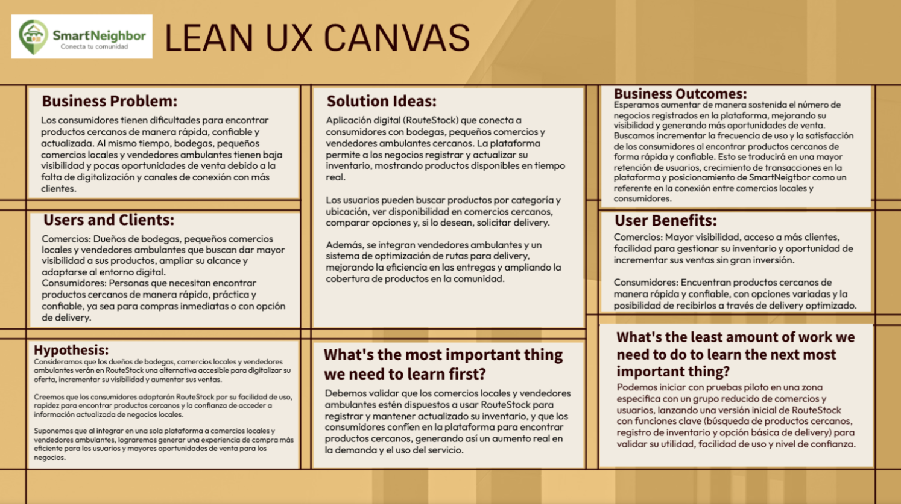

# **Universidad Peruana de Ciencias Aplicadas**

### **Informe de Trabajo Final**

**Carrera**: Ingeniería de Software

**Curso**: Desarrollo de Aplicaciones Open Source

**Sección**: 1ASI0729-2610-10155

**Profesor**: Hugo Allan Mori Paiva

**Ciclo**: 2026-1

**Startup:** SmartNeighbor

**Nombre del Producto**: RouteStock

**Integrantes**:

Luis Angel Cisneros Salas (U20211B198)
 Luis German Tello Quispe (U202317767)
 Alison Arrieta (U202312031)
 Alfaro Coveñas, Louis Piero (u20191b299)

**Abril del 2026**

#
# **Registro de Versiones del Informe**

|Versión|Fecha|Autor|Descripción|
| :- | :- | :- | :- |
|1\.0 Avn1|23/04/2026|
Luis German Tello Quispe

Luis Angel Cisneros

Alfaro Coveñas Louis Piero

Alison Jimena Arrieta Quispe
|
[Contenido	4](#_heading=h.nsca8d7rezbs)

[Registro de Versiones del Informe	4](#_heading=h.8gxu27autull)

[Project Report Collaboration Insights	4](#_heading=h.iqfc12at5bpt)

[Contenido	4](#_heading=h.wkpb2ihpzcry)

[Student Outcome	4](#_heading=h.nbg6pah72qg3)

[1.](#_heading=h.iv3t72wpl8ge)[Capítulo I: Introducción	4](#_heading=h.iv3t72wpl8ge)

[1.1](#_heading=h.cef4nj5tp5jz)[Startup Profile	4](#_heading=h.cef4nj5tp5jz)

[1.1.1](#_heading=h.u8z3eha1kjlr)[Descripción de la Startup	4](#_heading=h.u8z3eha1kjlr)

[1.1.2](#_heading=h.so7ggpcn42dv)[Perfiles de integrantes del equipo	4](#_heading=h.so7ggpcn42dv)

[1.2](#_heading=h.1m24yvgbflqv)[Solution Profile	4](#_heading=h.1m24yvgbflqv)

[1.2.1](#_heading=h.6jokok7g5pjs)[Antecedentes y problemática	4](#_heading=h.6jokok7g5pjs)

[1.2.2](#_heading=h.aq79i3msu58b)[Lean UX Process	4](#_heading=h.aq79i3msu58b)

[1.3](#_heading=h.u9rq93k9sjtu)[Segmentos objetivo	4](#_heading=h.u9rq93k9sjtu)

[2.](#_heading=h.mpt88vqezrd5)[Capítulo II: Requirements Elicitation & Analysis	4](#_heading=h.mpt88vqezrd5)

[2.1](#_heading=h.ljhxf313n4wx)[Competidores	4](#_heading=h.ljhxf313n4wx)

[2.1.1](#_heading=h.ujj48hrqdi0c)[Análisis competitivo	4](#_heading=h.ujj48hrqdi0c)

[2.1.2](#_heading=h.my5j2aczngvl)[Estrategias y tácticas frente a competidores	4](#_heading=h.my5j2aczngvl)

[2.2](#_heading=h.kvwvqspqui7h)[Entrevistas	5](#_heading=h.kvwvqspqui7h)

[2.2.1](#_heading=h.7ese9n6lynt)[Diseño de entrevistas	5](#_heading=h.7ese9n6lynt)

[2.2.2](#_heading=h.okh2o93lng7c)[Registro de entrevistas	5](#_heading=h.okh2o93lng7c)

[2.2.3](#_heading=h.o04xobkxbyxf)[Análisis de entrevistas	5](#_heading=h.o04xobkxbyxf)

[2.3](#_heading=h.5a8vg9lw2y2c)[Needfinding	5](#_heading=h.5a8vg9lw2y2c)

[2.3.1](#_heading=h.t3o44d82qj3a)[User Personas	5](#_heading=h.t3o44d82qj3a)

[2.3.2](#_heading=h.lijtivpgh7c5)[User Task Matrix	5](#_heading=h.lijtivpgh7c5)

[2.3.3](#_heading=h.ll58dvw5y4kr)[User Journey Mapping	5](#_heading=h.ll58dvw5y4kr)

[2.3.4](#_heading=h.g6ujnqjos6ot)[Empathy Mapping	5](#_heading=h.g6ujnqjos6ot)

[2.4](#_heading=h.ne223vmjcl1k)[Big Picture Event Storming	5](#_heading=h.ne223vmjcl1k)

[2.5](#_heading=h.8x2fe8afchzg)[Ubiquitous Language	5](#_heading=h.8x2fe8afchzg)

[3.](#_heading=h.z0puptyhajil)[Capítulo III: Requirements Specification	5](#_heading=h.z0puptyhajil)

[3.1](#_heading=h.ninegv5ehvr6)[User Stories	5](#_heading=h.ninegv5ehvr6)

[3.2](#_heading=h.60m5bn8l7hr1)[Impact Mapping	5](#_heading=h.60m5bn8l7hr1)

[3.3](#_heading=h.zg59gto95pem)[Product Backlog	5](#_heading=h.zg59gto95pem)

[4.](#_heading=h.ftlgdwye8mrx)[Capítulo IV: Product Design	5](#_heading=h.ftlgdwye8mrx)

[4.1](#_heading=h.i1rqnvvb3607)[Style Guidelines	5](#_heading=h.i1rqnvvb3607)

[4.1.1](#_heading=h.ibxm6lyctd1o)[General Style Guidelines	5](#_heading=h.ibxm6lyctd1o)

[4.1.2](#_heading=h.apxm94j2hm3i)[Web Style Guidelines	5](#_heading=h.apxm94j2hm3i)

[4.2](#_heading=h.1wnlsnvmal0)[Information Architecture	5](#_heading=h.1wnlsnvmal0)

[4.2.1](#_heading=h.qdb0mttcqmkw)[Organization Systems	5](#_heading=h.qdb0mttcqmkw)

[4.2.2](#_heading=h.yzxfenmkk40k)[Labeling Systems	5](#_heading=h.yzxfenmkk40k)

[4.2.3](#_heading=h.l9q26x80sjql)[SEO Tags and Meta Tags	5](#_heading=h.l9q26x80sjql)

[4.2.4](#_heading=h.mv3rtgxu1jz1)[Searching Systems	6](#_heading=h.mv3rtgxu1jz1)

[4.2.5](#_heading=h.2hipzstl6721)[Navigation Systems	6](#_heading=h.2hipzstl6721)

[4.3](#_heading=h.rojhptn4iwi)[Landing Page UI Design	6](#_heading=h.rojhptn4iwi)

[4.3.1](#_heading=h.1d6yrvhnxfvs)[Landing Page Wireframe	6](#_heading=h.1d6yrvhnxfvs)

[4.3.2](#_heading=h.8ynxe0wd3cc4)[Landing Page Mock-up	6](#_heading=h.8ynxe0wd3cc4)

[4.4](#_heading=h.jo7z03iywcxs)[Web Applications UX/UI Design	6](#_heading=h.jo7z03iywcxs)

[4.4.1](#_heading=h.xcw6j978w1x1)[Web Applications Wireframes	6](#_heading=h.xcw6j978w1x1)

[4.4.2](#_heading=h.l9fkgpdvlhvm)[Web Applications Wireflow Diagrams	6](#_heading=h.l9fkgpdvlhvm)

[4.4.3](#_heading=h.wo40dt7nxvm)[Web Applications Mock-ups	6](#_heading=h.wo40dt7nxvm)

[4.4.4](#_heading=h.mye49oa1d0ib)[Web Applications User Flow Diagrams	6](#_heading=h.mye49oa1d0ib)

[4.5](#_heading=h.dqkl1v9s4wrd)[Web Applications Prototyping	6](#_heading=h.dqkl1v9s4wrd)

[4.6](#_heading=h.dsoyukexk86z)[Domain-Driven Software Architecture	6](#_heading=h.dsoyukexk86z)

[4.6.1](#_heading=h.7bmjrhaitftm)[Design-Level Event Storming	6](#_heading=h.7bmjrhaitftm)

[4.6.2](#_heading=h.9qsvjr9uw0uy)[Software Architecture Context Diagram	6](#_heading=h.9qsvjr9uw0uy)

[4.6.3](#_heading=h.bhhi3v3lg76c)[Software Architecture Container Diagrams	6](#_heading=h.bhhi3v3lg76c)

[4.6.4](#_heading=h.6mhar39s7ieo)[Software Architecture Component Diagrams	6](#_heading=h.6mhar39s7ieo)

[4.7](#_heading=h.2c7tnoucte9q)[Software Object-Oriented Design	6](#_heading=h.2c7tnoucte9q)

[4.7.1](#_heading=h.nbmdm9mz8i1x)[Class Diagrams	6](#_heading=h.nbmdm9mz8i1x)

[4.8](#_heading=h.gt5ce9a9u843)[Database Design	6](#_heading=h.gt5ce9a9u843)

[4.8.1](#_heading=h.id6qkfacivqe)[Database Diagrams	6](#_heading=h.id6qkfacivqe)

[5.](#_heading=h.vs16l3cu2sa)[Capítulo V: Product Implementation, Validation & Deployment	6](#_heading=h.vs16l3cu2sa)

[5.1](#_heading=h.rl921vfr5x5t)[Software Configuration Management	6](#_heading=h.rl921vfr5x5t)

[5.1.1](#_heading=h.wciwa96dqhjz)[Software Development Environment Configuration	6](#_heading=h.wciwa96dqhjz)

[5.1.2](#_heading=h.sxm29qydtv5w)[Source Code Management	6](#_heading=h.sxm29qydtv5w)

[5.1.3](#_heading=h.entremi3v14m)[Source Code Style Guide & Conventions	7](#_heading=h.entremi3v14m)

[5.1.4](#_heading=h.ogohwao3lwy5)[Software Deployment Configuration	7](#_heading=h.ogohwao3lwy5)

[5.2](#_heading=h.gahcrecuaroi)[Landing Page, Services & Applications Implementation	7](#_heading=h.gahcrecuaroi)

[Conclusiones	7](#_heading=h.43pqdzlh8r5j)

[Bibliografía	7](#_heading=h.rf3ije8prsh)

[Anexos](#_heading=h.gmdtiwg9ege6)
|
|1\.1||||

# **Project Report Collaboration Insights**

TB1: Para el desarrollo del informe perteneciente a la entrega TB1, se dividió la implementación de secciones de la siguiente forma para cada integrante del equipo:
|Integrante|Tareas Designadas|
| :- | :- |
|Louis Piero Alfaro Coveñas|Implemente todo el capitulo 2 y aporte para el diseño de base de datos y clase diagrama además aporte con la LandingPage.|
|Luis German Tello Quispe|Desarrollo del capitulo 3 y los wireframes|
|Luis Angel Cisneros Salas|Elaboración de los diagramas C4 (Context, Container y Component), entrevista del Segmento 1 y correcciones del Capítulo 2.|
|Alison Arrieta|Desarrollo del capitulo 1, desarrollo de las epicas y user stories relacionadas|
|||

# **Student Outcome**
El curso contribuye al cumplimiento del Student Outcome ABET: ABET – EAC - Student Outcome 3 Criterio: Capacidad de comunicarse efectivamente con un rango de audiencias. En el siguiente cuadro se describe las acciones realizadas y enunciados de conclusiones por parte del grupo, que permiten sustentar el haber alcanzado el logro del ABET – EAC - Student Outcome 3.

|Criterio específico|` `Acciones Realizadas|Conclusiones|
| :- | :- | :- |
|Comunicación empática y analítica con usuarios y stakeholders|
**U20191b299 - Louis Piero Alfaro Coveñas**

**Avn1:**

Desarrollo íntegro del Capítulo II: Requirements Elicitation & Analysis. Esto incluyó el diseño, ejecución y análisis de entrevistas tanto a dueños de bodegas como a consumidores. Además, elaboré artefactos visuales de comunicación como Empathy Maps y User Journey Maps.

**U20211B198- Luis Angel Cisneros Salas**

**Avn1:**

Elaboré los diagramas de Software Architecture utilizando el modelo C4, incluyendo el Context Diagram, Container Diagram y Component Diagrams para el sistema RouteStock. Realicé entrevistas a representantes de ambos segmentos objetivo para la recolección de requisitos. Además, participé en las correcciones del Capítulo 2, mejorando la calidad y coherencia de los artefactos de UX Research.

**U202317767 - Luis German Tello Quispe**

**Avn1:**

Redacción técnica del Capítulo 3: Especificación de User Stories, Impact Mapping y estructuración del Product Backlog.

**u202312031 - Alison Jimena Arrieta Quispe**

**Avn1:**

Desarrollé el Capítulo I del proyecto, abordando el Solution Profile, antecedentes, problemática y aplicación del método 5W + 2H para explicar de manera clara el contexto de SmartNeighbor y la solución RouteStock. Además, trabajé el Lean UX Process, incluyendo los Problem Statements, Assumptions, Hypothesis Statements, Lean UX Canvas y la definición de los segmentos objetivo. También participé en el desarrollo de las épicas, algunas user stories relacionadas y en la organización de información obtenida mediante entrevistas a los usuarios.
|
**U20191b299 - Louis Piero Alfaro Coveñas**

**Avn1:**

Se logró interpretar y traducir las necesidades reales y los "dolores" de los usuarios finales en requerimientos documentados claros. Esto demuestra la capacidad de adaptar la comunicación para interactuar con personas ajenas al desarrollo de software, extraer información valiosa y presentarla de forma comprensible para todo el equipo.

**U20211B198- Luis Angel Cisneros Salas**

**Avn1:**

La elaboración de los diagramas C4 me permitió comunicar de forma clara y estructurada la arquitectura del sistema a diferentes niveles de audiencia, desde una visión general del contexto hasta el detalle de los componentes internos. Las entrevistas que realicé contribuyeron a validar los requisitos identificados con usuarios reales de ambos segmentos.

**U202317767 - Luis German Tello Quispe**

**Avn1:**

Logré traducir las necesidades del negocio y de los usuarios, comerciantes y consumidores, en especificaciones técnicas claras, asegurando que tanto stakeholders como desarrolladores comprendan exactamente qué funcionalidades construir.

**u202312031 - Alison Jimena Arrieta Quispe**

**Avn1:**

Logré explicar la problemática del proyecto desde una perspectiva clara, empática y centrada en los usuarios, identificando las necesidades de comerciantes, vendedores ambulantes y consumidores. El desarrollo del Capítulo I permitió ordenar la información inicial del proyecto y convertirla en una base sólida para comprender el problema, justificar la propuesta de valor y orientar el resto del trabajo hacia necesidades reales del mercado.
|
|Comunicación técnica y arquitectónica |
**U20191b299 - Louis Piero Alfaro Coveñas**

**Avn1:**

Aporte sustancial en el Capítulo IV (Product Design), específicamente en la formulación del diseño de base de datos y la estructuración del diagrama de clases

**U20211B198- Luis Angel Cisneros Salas**

**Avn1:**

Elaboré los diagramas de arquitectura de software bajo el modelo C4, desarrollando el Context Diagram, Container Diagram y Component Diagrams para el sistema RouteStock, comunicando de forma estructurada la arquitectura a distintos niveles de detalle.

**U202317767 - Luis German Tello Quispe**

**Avn1:**

Diseño y elaboración de los Wireframes para el Landing Page y las Web Applications.

**u202312031 - Alison Jimena Arrieta Quispe**

**Avn1:**

Desarrollé la base conceptual y funcional del proyecto desde el Capítulo I, estructurando la problemática, los antecedentes, el análisis 5W + 2H, el Lean UX Canvas y las hipótesis principales de RouteStock. Asimismo, contribuí en la definición de épicas y algunas user stories, conectando las necesidades identificadas en las entrevistas con funcionalidades concretas para la solución.
|
**U20191b299 - Louis Piero Alfaro Coveñas**

**Avn1:**

Al utilizar lenguajes de modelado estandarizados, como UML y diagramas entidad-relación, se logró comunicar la complejidad de la lógica de negocio y la arquitectura de la información. Esto permitió que los demás ingenieros y desarrolladores del equipo comprendan la estructura interna del sistema sin ambigüedades.

**U20211B198- Luis Angel Cisneros Salas**

**Avn1:**

La elaboración de los diagramas C4 me permitió representar la arquitectura del sistema de forma clara y estandarizada, facilitando que todos los miembros del equipo comprendieran la estructura interna sin ambigüedades.

**U202317767 - Luis German Tello Quispe**

**Avn1:**

Pude representar la arquitectura de información y las reglas de negocio a través de esquemas visuales intuitivos, facilitando la comprensión del flujo de interacción del producto antes de su implementación en código.

**u202312031 - Alison Jimena Arrieta Quispe**

**Avn1:**

Mi aporte permitió conectar el análisis inicial del problema con la estructura funcional del producto. A partir del Lean UX Canvas, las hipótesis, las épicas y las user stories, se logró establecer una base ordenada para que el equipo pueda comprender qué necesidades debía resolver RouteStock y cómo estas podían traducirse luego en componentes, funcionalidades y decisiones técnicas.
|
|Comunicación comercial y persuasiva|
**U20191b299 - Louis Piero Alfaro Coveñas**

**Avn1:**

Contribución directa en el diseño y desarrollo de la Landing Page del proyecto.

**U20211B198- Luis Angel Cisneros Salas**

**Avn1:**

Participé en la definición del perfil de los segmentos objetivo y realicé entrevistas a usuarios de ambos segmentos, contribuyendo a identificar las necesidades reales del mercado para orientar la propuesta de valor de RouteStock.

**U202317767 - Luis German Tello Quispe**

**Avn1:**

Sustentación de mi avance y defensa de los artefactos en el video de exposición de la entrega avn1.

**u202312031 - Alison Jimena Arrieta Quispe**

**Avn1:**

Desarrollé la presentación inicial del proyecto desde el Capítulo I, explicando la propuesta de SmartNeighbor y RouteStock mediante los antecedentes, problemática, análisis 5W + 2H, Lean UX Problem Statements, Lean UX Assumptions, Hypothesis Statements, Lean UX Canvas y segmentos objetivo. Además, contribuí en la formulación de épicas, algunas user stories y en el uso de información obtenida en entrevistas para reforzar la propuesta de valor del producto.
|
**U20191b299 - Louis Piero Alfaro Coveñas**

**Avn1:**

Se demostró la capacidad de simplificar el lenguaje técnico del proyecto y transformarlo en un mensaje comercial atractivo. La Landing Page comunica efectivamente la propuesta de valor de RouteStock, adaptando el tono visual y textual para captar y persuadir a futuros clientes, tanto comerciantes como usuarios urbanos

**U20211B198- Luis Angel Cisneros Salas**

**Avn1:**

A través de las entrevistas que realicé pude validar la propuesta de valor de RouteStock con usuarios reales, confirmando la necesidad de una plataforma que digitalice los comercios locales y facilite la búsqueda de productos cercanos para los consumidores urbanos.

**U202317767 - Luis German Tello Quispe**

**Avn1:**

Logré adaptar mi lenguaje verbal para explicar la lógica detrás de los requerimientos y las decisiones de diseño UI, haciéndolo comprensible y directo para una audiencia de evaluadores técnicos y funcionales.

**u202312031 - Alison Jimena Arrieta Quispe**

**Avn1:**

Logré comunicar la propuesta de valor de RouteStock de manera clara y convincente, resaltando su importancia para digitalizar pequeños comercios, dar mayor visibilidad a bodegas y vendedores ambulantes, y facilitar que los consumidores encuentren productos cercanos. El desarrollo del Capítulo I permitió presentar el proyecto con un enfoque más estratégico, mostrando no solo el problema, sino también la oportunidad de negocio, los usuarios involucrados y el valor diferencial de la solución.
|

**Contenido**

[Capítulo I: Introducción](#_heading=h.iv3t72wpl8ge)

[Startup Profile](#_heading=h.cef4nj5tp5jz)

[Descripción de la Startup](#_heading=h.u8z3eha1kjlr)

[Perfiles de integrantes del equipo](#_heading=h.so7ggpcn42dv)

[Solution Profile](#_heading=h.1m24yvgbflqv)

[Antecedentes y problemática](#_heading=h.6jokok7g5pjs)

[Lean UX Process](#_heading=h.aq79i3msu58b)

[Segmentos objetivo](#_heading=h.u9rq93k9sjtu)

[Capítulo II: Requirements Elicitation & Analysis](#capítulo-ii:-requirements-elicitation-&-analysis)

[Competidores](#competidores)

[Análisis competitivo](#análisis-competitivo)

[Estrategias y tácticas frente a competidores](#estrategias-y-tácticas-frente-a-competidores)

[Entrevistas](#entrevistas)

[Diseño de entrevistas](#diseño-de-entrevistas)

[Registro de entrevistas](#registro-de-entrevistas)

[Análisis de entrevistas](#análisis-de-entrevistas)

[Needfinding](#needfinding)

[User Personas](#user-personas)

[User Task Matrix](#user-task-matrix)

[User Journey Mapping](#user-journey-mapping)

[Empathy Mapping](#empathy-mapping)

[Big Picture Event Storming](#big-picture-event-storming)

[Ubiquitous Language](#ubiquitous-language)

[Capítulo III: Requirements Specification](#capítulo-iii:-requirements-specification)

[User Stories](#user-stories)

[Impact Mapping](#impact-mapping)

[Product Backlog](#product-backlog)

[Capítulo IV: Product Design](#capítulo-iv:-product-design)

[Style Guidelines](#style-guidelines)

[General Style Guidelines](#general-style-guidelines)

[Web Style Guidelines](#web-style-guidelines)

[Information Architecture](#information-architecture)

[Organization Systems](#organization-systems)

[Labeling Systems](#labeling-systems)

[SEO Tags and Meta Tags](#seo-tags-and-meta-tags)

[Searching Systems](#searching-systems)

[Navigation Systems](#navigation-systems)

[Landing Page UI Design](#landing-page-ui-design)

[Landing Page Wireframe](#landing-page-wireframe)

[Landing Page Mock-up](#landing-page-mock-up)

[Web Applications UX/UI Design](#web-applications-ux/ui-design)

[Web Applications Wireframes](#web-applications-wireframes)

[Web Applications Wireflow Diagrams](#web-applications-wireflow-diagrams)

[Web Applications Mock-ups](#web-applications-mock-ups)

[Web Applications User Flow Diagrams](#web-applications-user-flow-diagrams)

[Web Applications Prototyping](#web-applications-prototyping)

[Domain-Driven Software Architecture](#domain-driven-software-architecture)

[Design-Level Event Storming](#design-level-event-storming)

[Software Architecture Context Diagram](#software-architecture-context-diagram)

[Software Architecture Container Diagrams](#software-architecture-container-diagrams)

[Software Architecture Component Diagrams](#software-architecture-component-diagrams)

[Software Object-Oriented Design](#software-object-oriented-design)

[Class Diagrams](#class-diagrams)

[Database Design](#database-design)

[Database Diagrams](#database-diagrams)

[Capítulo V: Product Implementation, Validation & Deployment](#capítulo-v:-product-implementation,-validation-&-deployment)

[Software Configuration Management](#software-configuration-management)

[Software Development Environment Configuration](#software-development-environment-configuration)

[Source Code Management](#source-code-management)

[Source Code Style Guide & Conventions](#source-code-style-guide-&-conventions)

[Software Deployment Configuration](#software-deployment-configuration)

[Landing Page, Services & Applications Implementation](#landing-page,-services-&-applications-implementation)

[Validation Interviews](#validation-interviews)

[Diseño de Entrevistas](#diseño-de-entrevistas-1)

[Registro de Entrevistas](#registro-de-entrevistas-1)

[Evaluaciones según heurísticas](#evaluaciones-según-heurísticas)

[Video About-the-Product](#video-about-the-product)

[Conclusiones](#conclusiones)

[Bibliografía](#bibliografía)

[Anexos](#anexos)

1. # **Capítulo I: Introducción**

   1. ##  **Startup Profile**

### **Perfiles de integrantes del equipo**

|Integrantes|Descripción|Conocimientos|Foto|
| :- | :- | :- | :-: |
|
Alison Arrieta

u202312031
|Soy estudiante de la carrera de Ingeniería de Software. Me interesa mucho la parte de backend e implementar soluciones con IA.|Tengo conocimientos en Java con Spring Boot, C# con .NET, Angular, React y Vue||
|
Alfaro Coveñas Louis Piero

u20191b299
|Soy estudiante de la carrera de ingeniería de Sofware. Me gusta crear soluciones en base a lo que se requiera |Tengo conocimientos con Java SpringBoot C# Angular, PHP con Laravel.||
|
Luis German Tello Quispe

U202317767
|Soy un estudiante de la carrera de Ingeniería de Software. Me gusta el como funcionan los sistemas o aplicaciones tras la pantalla, y entenderlos en su totalidad.|Tengo conocimientos en C++, Java, bases de datos como SQL y MongoDB.||
|Cisneros Salas Luis Angel|Soy estudiante de Ingeniería de Software con experiencia en desarrollo Full Stack y móvil multiplataforma. Me destaco por mi adaptabilidad, pensamiento analítico y aprendizaje continuo, aportando soluciones eficientes centradas en la experiencia del usuario.|Tengo conocimientos en Java, JavaScript, Python, C++ y Dart. En frontend manejo React, Vue.js . En backend trabajo con Spring Boot y APIs RESTful. Manejo bases de datos como MySQL, PostgreSQL y Firestore, además de herramientas como Git, GCP, Render y Vercel.||

1. ##  **Solution Profile**

   1. ### **Antecedentes y problemática**

      Para explicar los fundamentos de nuestra startup utilizaremos una adaptación de la técnica de análisis 5W + 2H, la cual permite organizar la información respondiendo a las preguntas clave de cualquier iniciativa.

      **Antecedentes**

- En los últimos años, el crecimiento de los pequeños comercios, bodegas y vendedores ambulantes ha sido constante, especialmente en zonas urbanas donde abastecen necesidades inmediatas de la población. Sin embargo, muchos de estos negocios todavía trabajan de manera tradicional y no cuentan con herramientas digitales que les permitan mostrar sus productos, registrar su inventario o llegar a más clientes. Frente a ello, surge la oportunidad de desarrollar una plataforma digital que conecte a los usuarios con los comercios cercanos, facilitando la búsqueda de productos disponibles en su zona y contribuyendo a la digitalización de estos negocios.

**Problemática**

- Actualmente, muchas personas tienen dificultades para encontrar productos cercanos de manera rápida, ya que no existe un sistema centralizado que muestre qué comercios locales disponen de determinado artículo. A esto se suma la baja digitalización de pequeños negocios, que limita su visibilidad y reduce sus posibilidades de competir frente a supermercados o grandes cadenas. Como consecuencia, los consumidores pierden tiempo buscando productos y los comerciantes dejan pasar oportunidades de venta por no estar conectados digitalmente con sus potenciales clientes.

Aplicación del método 5W + 2H

**¿Qué?**

El proyecto busca responder a la falta de una plataforma eficiente que permita a los usuarios encontrar productos cercanos y, al mismo tiempo, ayude a las bodegas, comercios locales y vendedores ambulantes a digitalizar su inventario. La iniciativa está relacionada principalmente con dos tipos de usuarios: por un lado, los negocios que desean registrar y mostrar sus productos; y por otro, los consumidores que necesitan encontrar artículos de manera rápida y cercana.

**¿Cuándo?**

La problemática se presenta en el momento en que una persona necesita un producto de forma inmediata, pero desconoce qué negocio cercano lo tiene disponible. Del mismo modo, también aparece cuando un pequeño comerciante quiere aumentar sus ventas, pero no cuenta con una vitrina digital para llegar a más clientes. El uso de la plataforma se da justamente en esos escenarios: cuando el negocio registra su inventario y cuando el usuario consulta qué productos puede encontrar cerca de su ubicación.

**¿Dónde?**

El servicio puede utilizarse desde cualquier lugar con acceso a internet, ya sea desde un celular, una laptop o una tablet. Está orientado principalmente a zonas urbanas y comerciales, donde existe una gran cantidad de bodegas, pequeños comercios y vendedores ambulantes, pero donde aún no hay suficiente integración digital entre la oferta local y las necesidades de los consumidores.

**¿Quiénes?**

Participan principalmente dos grupos. El primero está conformado por los dueños de bodegas, comercios locales y vendedores ambulantes que desean tener mayor visibilidad y mejorar su proceso de venta. El segundo grupo está compuesto por los usuarios o consumidores que buscan productos cercanos, accesibles y disponibles en el menor tiempo posible. En consecuencia, el público objetivo de la plataforma está conformado por ambos segmentos, integrados en un mismo entorno digital.

**¿Por qué?**

La raíz del problema se encuentra en la falta de digitalización de los pequeños comercios y en la inexistencia de una plataforma que concentre información actualizada sobre productos cercanos. Esto ocasiona que los negocios tengan menor alcance comercial y que los usuarios no puedan acceder fácilmente a una búsqueda rápida, práctica y confiable de los productos que necesitan.

**¿Cómo?**

El servicio se utiliza cuando los negocios registran sus productos e inventario en la plataforma, permitiendo que los usuarios consulten qué artículos están disponibles cerca de su ubicación. Además, la propuesta incorpora a vendedores ambulantes y contempla la optimización de rutas para delivery, lo que amplía la cobertura y mejora la eficiencia del servicio. Los usuarios pueden llegar a la plataforma mediante redes sociales, publicidad digital, recomendaciones y la necesidad inmediata de encontrar un producto específico en su zona.

**¿Cuánto cuesta?**

Para los pequeños comercios, bodegas y vendedores ambulantes, la plataforma puede ofrecer un acceso asequible que les permita registrarse y mostrar sus productos sin requerir una gran inversión inicial. En cuanto a los usuarios, el uso de la plataforma para buscar productos puede mantenerse de forma gratuita, mientras que los costos adicionales estarían asociados únicamente a servicios complementarios, como el delivery. De esta manera, se busca que la solución sea accesible tanto para los negocios como para los consumidores.

1. ### **Lean UX Process**

   1. #### **Lean UX Problem Statements**

      RouteStock tiene como objetivo ofrecer una plataforma digital que facilite a los usuarios la búsqueda de productos cercanos y, al mismo tiempo, permita a bodegas, comercios locales y vendedores ambulantes registrar su inventario de manera sencilla y accesible. Sin embargo, la realidad actual se caracteriza por la baja digitalización de los pequeños negocios, la falta de visibilidad de sus productos y la ausencia de un sistema centralizado que conecte la oferta local con la demanda de los consumidores. Esto genera dificultades para encontrar productos de forma rápida, pérdida de oportunidades de venta para los comercios y una experiencia poco eficiente tanto para vendedores como para usuarios. Ante esta situación, se plantea la necesidad de mejorar el acceso a la información comercial mediante una solución más práctica e inclusiva, que integre a los pequeños negocios dentro de un entorno digital y optimice también aspectos como la cobertura de delivery y la cercanía en la compra.

      Consideramos que habremos alcanzado un avance significativo cuando logremos que cada vez más bodegas, comercios locales y vendedores ambulantes se registren en la plataforma, y que los usuarios puedan encontrar productos cercanos de manera rápida, confiable y con una oferta acorde a sus necesidades reales.

   1. #### **Lean UX Assumptions**

      **Segmento de Usuarios:**

      **¿Quién es el usuario?**

      Nuestros principales usuarios son dos. Por un lado, se encuentran los dueños de bodegas, pequeños comercios locales y vendedores ambulantes que desean dar mayor visibilidad a sus productos, mejorar su alcance y adaptarse al entorno digital. Por otro lado, se encuentran los consumidores que buscan productos cercanos de manera rápida, práctica y confiable, sin tener que recorrer varios establecimientos para encontrarlos.

      **¿Dónde se integra el servicio en su vida?**

      Para los comerciantes, RouteStock se integra como una herramienta digital que les permite mostrar su inventario, acercarse a más clientes y fortalecer sus ventas sin necesidad de realizar una gran inversión tecnológica. Para los consumidores, el servicio se integra en su vida cotidiana como una solución útil para ubicar productos cercanos en el momento en que los necesitan, ya sea desde casa, el trabajo o durante sus desplazamientos.

      **¿Cuándo y cómo se utiliza el servicio?**

      Los comerciantes utilizan la plataforma al registrar sus productos, actualizar su inventario y mantener visible su oferta para los usuarios. En cambio, los consumidores emplean RouteStock cuando necesitan encontrar un producto específico de manera inmediata, consultar qué negocios cercanos lo tienen disponible y, de ser posible, acceder también a opciones de delivery optimizadas mediante rutas más eficientes.

      **¿Qué problemas enfrenta el servicio?**

      El principal reto es lograr que los pequeños negocios adopten el uso de una plataforma digital de forma sencilla y constante, manteniendo actualizada la información de su inventario. Al mismo tiempo, también es un desafío asegurar que los consumidores encuentren datos confiables, resultados rápidos y una experiencia práctica al momento de buscar productos cercanos. Además, la integración de vendedores ambulantes y la optimización de rutas exige una coordinación eficiente para que el servicio realmente genere valor en la experiencia del usuario.

      **Resultados de Negocio (Business Outcomes):**

- Anticipamos que los dueños de bodegas, comercios locales y vendedores ambulantes valorarán una plataforma como RouteStock, ya que les permitirá aumentar su visibilidad comercial y acercarse a nuevos clientes de una manera simple y accesible.
- Creemos que los consumidores encontrarán en nuestro servicio una alternativa más rápida y útil para localizar productos cercanos, ahorrando tiempo y mejorando su experiencia de compra frente a la búsqueda tradicional.
- Reconocemos que existen otras opciones de compra digital y delivery en el mercado; sin embargo, nuestra propuesta se diferencia por enfocarse en los pequeños comercios de cercanía, incluir vendedores ambulantes y brindar una solución basada en inventario local y optimización de rutas.
- Sabemos que para mantener la confianza y el valor del servicio, SmartNeighbor deberá reforzar la usabilidad de RouteStock, promover la actualización constante del inventario, escuchar a sus usuarios y aplicar mejoras continuas que respondan a las necesidades reales tanto de comerciantes como de consumidores.

  1. #### **Lean UX Hypothesis Statements**

1. Consideramos que los dueños de bodegas, pequeños comercios locales y vendedores ambulantes que desean tener mayor visibilidad y aumentar sus oportunidades de venta verán en RouteStock una alternativa accesible para digitalizar su oferta de productos. Consideraremos que hemos alcanzado el éxito cuando estos negocios incrementen su participación en la plataforma, mantengan actualizado su inventario y logren una mayor interacción con los usuarios, reflejando confianza y utilidad en el servicio.
1. Creemos que los consumidores que buscan productos cercanos de manera rápida, práctica y confiable optarán por RouteStock gracias a su facilidad de uso, su enfoque en negocios locales y la disponibilidad de información útil sobre productos en su zona. Consideraremos que hemos alcanzado el éxito cuando aumente la frecuencia de uso de la plataforma, la cantidad de búsquedas realizadas y el nivel de satisfacción de los usuarios al encontrar productos de forma más eficiente.
1. Suponemos que al integrar en una sola solución digital a bodegas, comercios locales y vendedores ambulantes, SmartNeighbor podrá generar una experiencia de compra más completa y accesible para la comunidad. Consideraremos que hemos alcanzado el éxito cuando los indicadores del servicio reflejen un crecimiento sostenido en negocios registrados, una mejora en la visibilidad de la oferta local y una mayor eficiencia en la conexión entre la demanda de los usuarios y los productos disponibles en su entorno.

   1. #### **Lean UX Canvas**

      En el apartado de Lean UX Canvas se desarrolló una estructuración integral y académica de las principales hipótesis estratégicas que sustentan la propuesta de valor de la startup SmartNeighbor y de su solución digital RouteStock.

      Cada una de estas hipótesis fue representada mediante un Lean UX Canvas formal, siguiendo un enfoque de análisis y validación que articula los elementos centrales del proyecto: el problema de negocio identificado (Business Problem), las ideas de solución planteadas a nivel funcional y operativo (Solution Ideas), los resultados esperados para el negocio (Business Outcomes), la definición de los usuarios y clientes involucrados (Users and Clients), los beneficios esperados para dichos usuarios (User Benefits), la formulación de hipótesis clave (Hypothesis) y la identificación de los aprendizajes prioritarios junto con las acciones mínimas necesarias para validar la propuesta (What’s the most important thing we need to learn first? y What’s the least amount of work we need to do to learn the next most important thing?).

      Este trabajo metodológico permitió establecer un marco claro para la validación temprana de la propuesta, orientando el desarrollo de RouteStock hacia necesidades reales del mercado, especialmente en relación con la búsqueda de productos cercanos y la digitalización de bodegas, comercios locales y vendedores ambulantes. De esta manera, el Lean UX Canvas se convierte en una herramienta fundamental dentro del enfoque iterativo, ágil y centrado en el usuario de SmartNeighbor, ya que permite alinear las decisiones de diseño, funcionalidad y modelo de negocio con objetivos concretos, medibles y sostenibles.

Enlace para acceder al [Canvas](https://view.genially.com/69db033147694ae4309767e8)

1. ##  **Segmentos objetivo**

   **Segmento 1: Dueños de bodegas, pequeños comercios locales y vendedores ambulantes**

   Datos demográficos:

- Género: hombres y mujeres.
- Rango etario: de 20 a 65 años.
- Condición socioeconómica: sectores B, C y D.

Datos geográficos:

- Nacionalidad: peruana.
- Área de residencia: zonas urbanas y urbano-populares.
- Ubicación principal: Lima Metropolitana.

Datos psicográficos:

- Dueños de pequeños negocios que comercializan productos de consumo diario y que buscan aumentar sus ventas sin realizar una gran inversión en tecnología.
- Personas emprendedoras que desean dar mayor visibilidad a sus productos y adaptarse al entorno digital para competir con mercados más grandes, supermercados o aplicaciones consolidadas.
- Comerciantes que actualmente gestionan sus ventas de manera tradicional y que aún no cuentan con una herramienta práctica para mostrar su inventario, atraer clientes cercanos y mejorar su alcance comercial.
- Vendedores que valoran soluciones simples, rápidas y accesibles, que les permitan registrar sus productos y aprovechar mejor las oportunidades de venta dentro de su comunidad.

**Segmento 2: Consumidores o usuarios finales**

Datos demográficos:

- Género: masculino y femenino.
- Edad: entre 18 y 55 años.
- Nivel socioeconómico: sectores B, C y D.

Datos geográficos:

- Nacionalidad: peruana.
- Lugar de residencia: zonas urbanas.
- Ubicación principal: Lima Metropolitana.

Datos psicográficos:

- Personas que necesitan encontrar productos cercanos de manera rápida, confiable y práctica, especialmente para compras inmediatas o necesidades del día a día.
- Usuarios que valoran el ahorro de tiempo y prefieren conocer qué negocio cercano tiene disponible un producto antes de desplazarse o recorrer varios establecimientos.
- Consumidores que están familiarizados con el uso de aplicaciones móviles y plataformas digitales para resolver necesidades cotidianas, como compras, búsqueda de servicios o delivery.
- Personas que buscan alternativas más cercanas y accesibles dentro de su comunidad, priorizando la comodidad, la rapidez y la posibilidad de recibir productos mediante delivery.

2. # **Capítulo II: Requirements Elicitation & Analysis** {#capítulo-ii:-requirements-elicitation-&-analysis}

   1. ## **Competidores** {#competidores}

      1. ### **Análisis competitivo** {#análisis-competitivo}

      2. ### **Estrategias y tácticas frente a competidores** {#estrategias-y-tácticas-frente-a-competidores}

   2. ## **Entrevistas** {#entrevistas}

      1. ### **Diseño de entrevistas** {#diseño-de-entrevistas}

      2. ### **Registro de entrevistas** {#registro-de-entrevistas}

      3. ### **Análisis de entrevistas** {#análisis-de-entrevistas}

   3. ## **Needfinding** {#needfinding}

      1. ### **User Personas** {#user-personas}

      2. ### **User Task Matrix** {#user-task-matrix}

      3. ### **User Journey Mapping** {#user-journey-mapping}

      4. ### **Empathy Mapping** {#empathy-mapping}

   4. ## **Big Picture Event Storming** {#big-picture-event-storming}

   5. ## **Ubiquitous Language** {#ubiquitous-language}

## **3. Capítulo III: Requirements Specification**

## **3.1.User Stories**

| Epic / Story ID | Título | Descripción | Criterios de Aceptación | Relacionado con(Epic ID) |
| :---- | :---- | :---- | :---- | :---- |
| **EP01** | Información del producto en Landing Page | Como visitante, quiero entender qué ofrece RouteStock para decidir si me registro para buscar productos cercanos o para empezar a digitalizar y ofrecer el inventario de mi pequeño negocio. | **Escenario 1: Comprender la propuesta de valor central**  Given el visitante accede a la landing page del sitio web When explora el contenido principal Then comprende que la plataforma conecta a consumidores con bodegas, comercios locales y vendedores ambulantes para encontrar productos en su zona de manera rápida y confiable.  **Escenario 2: Diferenciación y beneficios del servicio**  Given el visitante compara RouteStock con la búsqueda tradicional u otras aplicaciones de delivery When evalúa los beneficios destacados en la página Then identifica que el servicio se enfoca exclusivamente en el comercio de cercanía, permitiendo a los negocios ganar visibilidad sin gran inversión tecnológica y a los usuarios ahorrar tiempo localizando inventario real. |  |
| **EP02** | Crear cuenta como usuario  | Como usuario (comerciante o consumidor), quiero crear una cuenta en RouteStock para acceder a la plataforma y utilizar sus funcionalidades, ya sea para registrar productos y gestionar mi inventario o para buscar productos cercanos de manera rápida y confiable. | **Escenario 1: Iniciar proceso de registro** Given el usuario accede al flujo de creación de cuenta en RouteStockWhen ingresa sus datos básicos (nombre, correo electrónico, contraseña y tipo de usuario: comerciante o consumidor)Then el sistema registra la información y envía un correo de verificación para activar la cuenta **Escenario 2: Confirmar cuenta** Given el usuario recibe el correo de verificación When hace clic en el enlace de activación Then su cuenta queda validada y lista para ser utilizada **Escenario 3: Acceder por primera vez según tipo de usuario** Given el usuario ha confirmado su cuenta When inicia sesión por primera vez Then accede a funcionalidades personalizadas según su perfil: Comerciante: opción para registrar productos e inventario Consumidor: opción para buscar productos cercanos **Escenario 4: Validación de datos obligatorios** Given el usuario se encuentra en el formulario de registro When intenta registrarse sin completar los campos obligatorios o con datos inválidos Then el sistema muestra mensajes de error y no permite continuar con el registro |  |
| **EP03** | Gestión de Inventario (Comerciante)  | Como comerciante (bodega, negocio local o vendedor ambulante), quiero gestionar mi inventario dentro de RouteStock para registrar, actualizar y mantener visibles mis productos, de manera que los usuarios puedan encontrarlos fácilmente y mejorar mis oportunidades de venta. | **Escenario 1: Registrar productos** Given el comerciante ha iniciado sesión en la plataforma When ingresa la información de un producto (nombre, precio, disponibilidad u otros datos básicos) Then el sistema guarda el producto y lo muestra como disponible en su inventario **Escenario 2: Actualizar inventario** Given el comerciante tiene productos registrados When modifica la información de un producto (precio, stock o disponibilidad) Then el sistema actualiza los datos y refleja los cambios en la plataforma **Escenario 3: Visualizar productos registrados** Given el comerciante ha registrado productos en su inventario When accede a la sección de inventario Then el sistema muestra la lista de productos disponibles con su información actualizada |  |
| **EP04** | Búsqueda y Exploración (Consumidor) | Como consumidor, quiero buscar y explorar productos cercanos en RouteStock para encontrar de manera rápida y confiable lo que necesito, considerando la disponibilidad en negocios locales y mi ubicación. | **Escenario 1: Buscar producto** Given el consumidor ha ingresado a la plataforma When realiza la búsqueda de un producto específico Then el sistema muestra una lista de resultados con los productos disponibles en negocios cercanos **Escenario 2: Visualizar detalles del producto** Given el consumidor obtiene resultados de búsqueda When selecciona un producto Then el sistema muestra información relevante como nombre, precio, disponibilidad y negocio que lo ofrece **Escenario 3: Filtrar resultados** Given el consumidor visualiza los resultados de búsqueda When aplica filtros (por cercanía, disponibilidad u otros criterios) Then el sistema actualiza los resultados mostrando opciones más relevantes según su necesidad |  |
| **EP05** | Gestión de Pedidos y Carrito | Como consumidor, quiero gestionar un carrito de compras y realizar pedidos en RouteStock para seleccionar productos de negocios cercanos, confirmar mi compra y acceder a opciones de entrega o recojo de manera práctica. | **Escenario 1: Agregar productos al carrito** Given el consumidor visualiza un producto disponible When decide agregarlo al carrito Then el sistema incluye el producto en su carrito con la información correspondiente **Escenario 2: Gestionar carrito** Given el consumidor tiene productos en su carrito When modifica la cantidad o elimina productos Then el sistema actualiza el carrito reflejando los cambios realizados **Escenario 3: Confirmar pedido** Given el consumidor tiene productos en su carrito When confirma la compra Then el sistema genera el pedido y registra la información para su procesamiento **Escenario 4: Visualizar estado del pedido** Given el consumidor ha realizado un pedido When accede a sus pedidos Then el sistema muestra el estado del pedido (pendiente, en proceso u otros estados definidos) |  |
| **EP06** | Interacción y Contacto | Como consumidor, quiero poder interactuar y contactar a los comerciantes a través de RouteStock para resolver dudas, confirmar disponibilidad de productos o coordinar detalles de compra, mejorando así la confianza y la experiencia de compra. | **Escenario 1: Iniciar contacto con el comerciante** Given el consumidor visualiza un producto o negocio When decide contactar al comerciante Then el sistema permite enviar un mensaje o solicitud de contacto con la información necesaria **Escenario 2: Recepción de mensajes** Given el comerciante ha sido contactado por un consumidor When accede a sus mensajes Then el sistema muestra la información enviada para que pueda responder o gestionar la solicitud |  |
| **EP07** | API Y Backend | Como desarrollador, quiero implementar la API y la lógica de backend de RouteStock para gestionar de manera segura, eficiente y centralizada la información de usuarios, inventario, búsquedas, pedidos e interacciones, permitiendo el correcto funcionamiento de la plataforma. | **Escenario 1: Gestión de datos desde la API** Given el sistema requiere procesar información de usuarios, productos, inventario o pedidos When el frontend realiza una solicitud al backend Then la API procesa la solicitud y devuelve una respuesta estructurada con los datos correspondientes **Escenario 2: Validación de solicitudes** Given el backend recibe información desde la aplicación When los datos enviados están incompletos, son inválidos o no cumplen las reglas definidas Then el sistema rechaza la solicitud y devuelve un mensaje de validación correspondiente   Given una operación válida es procesada por la API When el backend registra, actualiza o consulta información Then los datos quedan almacenados y disponibles de forma consistente en la base de datos |  |
| **US01** | Ver propuesta de valor | Como visitante, deseo visualizar la propuesta de RouteStock para entender sus beneficios. | **1\.** **Dado** que un visitante ingresa al Landing Page, **Cuando** la página carga, **Entonces** el sistema muestra el Hero principal.  **2\.** **Dado** que el visitante explora, **Cuando** visualiza la sección de beneficios, **Entonces** el sistema presenta iconos descriptivos. | **EP-01** |
| **US02** | Navegar a los planes | Como visitante comerciante, deseo ver los beneficios de la red para evaluar mi registro. | **1\.** **Dado** que un visitante está en el Landing Page, **Cuando** hace clic en "Para Negocios", **Entonces** el sistema lo desplaza a la sección informativa.  **2\.** **Dado** que el visitante lee la sección, **Cuando** revisa las características, **Entonces** el sistema muestra los pasos para digitalizar. | **EP-01** |
| **US03** | Redirección a la app | Como visitante, deseo un botón de acceso directo para iniciar sesión o registrarme. | **1\.** **Dado** que un visitante hace clic en "Ingresar a la App", **Cuando** la redirección se completa, **Entonces** el sistema muestra el Login.  **2\.** **Dado** que el usuario entra por el Landing Page, **Cuando** carga la app, **Entonces** la URL cambia al dominio de la Web Application. | **EP-01** |
| **US04** | Ver Términos y Cond. | Como visitante, deseo leer los Términos y Condiciones para conocer mis derechos. | **1\.** **Dado** que un visitante está en el Footer, **Cuando** hace clic en "Términos y Condiciones", **Entonces** el sistema muestra la vista legal.  **2\.** **Dado** que el usuario lee el documento, **Cuando** revisa el texto, **Entonces** este abarca normas de responsabilidad y ética. | **EP-01** |
| **US05** | Cambiar idioma (i18n) | Como usuario, deseo poder cambiar el idioma de la plataforma entre Español e Inglés. | **1\.** **Dado** que el usuario hace clic en el selector de idioma, **Cuando** elige "English", **Entonces** la interfaz traduce sus etiquetas.  **2\.** **Dado** que el idioma está en Inglés, **Cuando** el usuario recarga la página, **Entonces** el sistema recuerda su preferencia de idioma. | **EP-01** |
| **US06** | Accesibilidad teclado | Como usuario con discapacidad, deseo navegar por la web usando la tecla Tab. | **1\.** **Dado** que el usuario presiona "Tab", **Cuando** navega por el menú, **Entonces** el foco visual resalta el elemento seleccionado.  **2\.** **Dado** que el usuario utiliza un lector de pantalla, **Cuando** pasa por un botón, **Entonces** el sistema lee el atributo ARIA correspondiente. | **EP-01** |
| **US07** | Registro de consumidor | Como consumidor, deseo crear una cuenta para poder buscar productos cercanos. | **1\.** **Dado** que un consumidor ingresa sus datos válidos, **Cuando** hace clic en "Registrar", **Entonces** el sistema crea la cuenta.  **2\.** **Dado** que el usuario intenta registrarse, **Cuando** deja campos vacíos, **Entonces** el sistema muestra alertas de validación. | **EP-02** |
| **US08** | Registro de comerciante | Como comerciante, deseo registrar mi negocio para digitalizar mi inventario. | **1\.** **Dado** que un comerciante llena el formulario, **Cuando** envía los datos, **Entonces** el sistema registra el perfil.  **2\.** **Dado** que el sistema detecta que el RUC/DNI ya existe, **Cuando** procesa el envío, **Entonces** muestra un mensaje de error por duplicidad. | **EP-02** |
| **US09** | Inicio de sesión | Como usuario registrado, deseo iniciar sesión para acceder a mis funcionalidades. | **1\.** **Dado** que un usuario ingresa credenciales correctas, **Cuando** hace clic en "Entrar", **Entonces** el sistema otorga acceso.  **2\.** **Dado** que el usuario ingresa datos erróneos, **Cuando** intenta autenticarse, **Entonces** el sistema muestra "Credenciales incorrectas". | **EP-02** |
| **US10** | Cerrar sesión | Como usuario autenticado, deseo poder cerrar mi sesión para proteger mi información. | **1\.** **Dado** que un usuario hace clic en "Cerrar sesión", **Cuando** el sistema procesa la orden, **Entonces** invalida el token de acceso.  **2\.** **Dado** que la sesión se cierra, **Cuando** el proceso termina, **Entonces** redirige al usuario a la vista de Login. | **EP-02** |
| **US11** | Checkbox de Términos | Como visitante, deseo aceptar explícitamente los TyC al registrarme. | **1\.** **Dado** que un usuario llena el registro, **Cuando** no marca el checkbox de TyC, **Entonces** el sistema deshabilita el botón de enviar.  **2\.** **Dado** que el usuario marca el checkbox, **Cuando** hace clic en registrar, **Entonces** el sistema permite la transacción. | **EP-02** |
| **US12** | Auth API Google | Como visitante, deseo iniciar sesión usando mi cuenta de Google mediante una API externa. | **1\.** **Dado** que el usuario hace clic en "Continuar con Google", **Cuando** autoriza la app, **Entonces** el sistema consume la API y crea la sesión.  **2\.** **Dado** que el usuario cancela el flujo de Google, **Cuando** la ventana se cierra, **Entonces** el sistema muestra un mensaje de cancelación. | **EP-02** |
| **US13** | Notificación email API | Como usuario, deseo recibir un correo de confirmación al registrarme usando un API externo. | **1\.** **Dado** que el usuario completa su registro, **Cuando** el backend procesa la solicitud, **Entonces** consume una API de correos (ej. SendGrid) para enviar la confirmación.  **2\.** **Dado** que el correo se envía, **Cuando** el usuario lo abre, **Entonces** visualiza un diseño responsivo de bienvenida. | **EP-02** |
| **US14** | Editar perfil de negocio | Como comerciante, deseo editar la información de mi negocio para mantenerla actualizada. | **1\.** **Dado** que un comerciante modifica su horario, **Cuando** guarda los cambios, **Entonces** el sistema actualiza la base de datos.  **2\.** **Dado** que los cambios son guardados, **Cuando** un cliente visita el perfil, **Entonces** visualiza los datos actualizados. | **EP-03** |
| **US15** | Añadir nuevo producto | Como comerciante, deseo agregar un producto a mi inventario para que sea visible. | **1\.** **Dado** que el comerciante ingresa nombre y precio, **Cuando** guarda, **Entonces** el sistema lo añade al inventario.  **2\.** **Dado** que se añade un producto, **Cuando** no se incluye un precio válido, **Entonces** el sistema impide el guardado. | **EP-03** |
| **US16** | Editar precio | Como comerciante, deseo modificar el precio de un producto para ajustarme al mercado. | **1\.** **Dado** que el comerciante actualiza el campo de precio y confirma, **Cuando** el sistema procesa, **Entonces** guarda el nuevo valor.  **2\.** **Dado** que el precio cambia, **Cuando** finaliza, **Entonces** muestra una notificación de éxito. | **EP-03** |
| **US17** | Eliminar producto | Como comerciante, deseo eliminar un producto que ya no ofrezco. | **1\.** **Dado** que el comerciante pulsa "Eliminar", **Cuando** el sistema detecta la acción, **Entonces** pide una confirmación previa.  **2\.** **Dado** que el usuario confirma, **Cuando** se ejecuta la orden, **Entonces** el producto desaparece del inventario. | **EP-03** |
| **US18** | Marcar sin stock | Como comerciante, deseo cambiar el estado a "agotado" para informar a mis clientes. | **1\.** **Dado** que un producto se queda sin unidades, **Cuando** se activa "Agotado", **Entonces** el sistema cambia la etiqueta visual.  **2\.** **Dado** que un ítem está agotado, **Cuando** un consumidor busca, **Entonces** el sistema lo oculta de los resultados. | **EP-03** |
| **US19** | Buscar por nombre | Como consumidor, deseo usar una barra de búsqueda para encontrar productos. | **1\.** **Dado** que un consumidor escribe un producto y presiona enter, **Cuando** el sistema busca, **Entonces** muestra los negocios que lo ofrecen.  **2\.** **Dado** que no hay coincidencias, **Cuando** termina la búsqueda, **Entonces** el sistema muestra "No se encontraron resultados". | **EP-04** |
| **US20** | Explorar por categoría | Como consumidor, deseo filtrar comercios por tipo para elegir dónde comprar. | **1\.** **Dado** que el consumidor elige "Bodega", **Cuando** se aplica el filtro, **Entonces** el sistema muestra solo esos negocios.  **2\.** **Dado** que se cambia a "Ambulante", **Cuando** procesa la solicitud, **Entonces** actualiza la lista con vendedores registrados. | **EP-04** |
| **US21** | Ver detalle de comercio | Como consumidor, deseo entrar al perfil de un negocio para ver su catálogo completo. | **1\.** **Dado** que el consumidor hace clic en un comercio, **Cuando** carga la vista, **Entonces** el sistema muestra el catálogo.  **2\.** **Dado** que la vista de detalle carga, **Cuando** el usuario hace scroll, **Entonces** muestra la información de contacto. | **EP-04** |
| **US22** | Ver ubicación en Mapa | Como consumidor, deseo ver la ubicación exacta del comercio en un mapa interactivo. | **1\.** **Dado** que el consumidor visualiza el perfil del negocio, **Cuando** carga la sección de ubicación, **Entonces** el sistema carga un mapa vía API externa.  **2\.** **Dado** que el usuario interactúa con el mapa, **Cuando** hace zoom, **Entonces** la API renderiza el mapa sin perder el pin del local. | **EP-04** |
| **US23** | Ver promedio de estrellas | Como consumidor, deseo ver la calificación promedio de un comercio antes de comprar. | **1\.** **Dado** que el consumidor busca locales, **Cuando** aparecen los resultados, **Entonces** el sistema muestra las estrellas junto al nombre del local.  **2\.** **Dado** que un negocio no tiene reseñas, **Cuando** se visualiza su perfil, **Entonces** el sistema muestra el texto "Nuevo negocio". | **EP-04** |
| **US24** | Añadir ítem al carrito | Como consumidor, deseo agregar productos a un carrito virtual. | **1\.** **Dado** que el consumidor hace clic en "Agregar", **Cuando** el sistema procesa, **Entonces** incrementa el contador del carrito.  **2\.** **Dado** que se agrega un ítem repetido, **Cuando** se actualiza, **Entonces** incrementa la cantidad sin duplicar la fila. | **EP-05** |
| **US25** | Confirmar pedido | Como consumidor, deseo enviar mi lista de compra al comerciante. | **1\.** **Dado** que el consumidor confirma el pedido, **Cuando** se completa la transacción, **Entonces** el sistema genera una orden "Pendiente".  **2\.** **Dado** que el pedido se confirma, **Cuando** se crea la orden, **Entonces** el sistema limpia automáticamente el carrito. | **EP-05** |
| **US26** | Ver pedidos entrantes | Como comerciante, deseo ver los pedidos de los clientes para prepararlos. | **1\.** **Dado** que el comerciante accede a "Pedidos", **Cuando** la vista carga, **Entonces** el sistema muestra las solicitudes nuevas primero.  **2\.** **Dado** que hay pedidos pendientes, **Cuando** los revisa, **Entonces** el sistema muestra el detalle de productos. | **EP-05** |
| **US27** | Aceptar pedido | Como comerciante, deseo marcar un pedido como "Listo" para avisar al cliente. | **1\.** **Dado** que un pedido ha sido preparado, **Cuando** el comerciante pulsa "Marcar como listo", **Entonces** el sistema actualiza el estado.  **2\.** **Dado** que el estado cambia, **Cuando** se refresca, **Entonces** el sistema marca el pedido con un color distintivo. | **EP-05** |
| **US28** | Ver estado de mis pedidos | Como consumidor, deseo revisar mis pedidos para saber si puedo ir a recogerlos. | **1\.** **Dado** que el consumidor revisa "Mis Compras", **Cuando** carga el historial, **Entonces** el sistema muestra el estado de cada pedido.  **2\.** **Dado** que un pedido cambia a "Listo", **Cuando** el usuario ingresa, **Entonces** el sistema actualiza la etiqueta visualmente. | **EP-05** |
| **US29** | Elegir tipo de entrega | Como consumidor, deseo poder elegir entre Delivery o Recojo en tienda para mi pedido. | **1\.** **Dado** que el consumidor confirma el carrito, **Cuando** selecciona la opción de entrega, **Entonces** el sistema habilita el campo de "Dirección" si elige Delivery.  **2\.** **Dado** que elige Recojo, **Cuando** avanza, **Entonces** el sistema omite el cobro por envío. | **EP-05** |
| **US30** | Añadir dirección | Como consumidor, deseo registrar mi dirección de entrega para recibir mi pedido. | **1\.** **Dado** que el consumidor selecciona Delivery, **Cuando** ingresa su calle y distrito, **Entonces** el sistema guarda la dirección en la orden.  **2\.** **Dado** que el campo de dirección está vacío, **Cuando** intenta confirmar, **Entonces** el sistema exige llenarlo. | **EP-05** |
| **US31** | Contactar al comerciante | Como consumidor, deseo un botón de WhatsApp para coordinar detalles. | **1\.** **Dado** que el consumidor pulsa el botón de WhatsApp, **Cuando** el sistema procesa, **Entonces** abre la aplicación de mensajería externa.  **2\.** **Dado** que se inicia el contacto, **Cuando** genera el enlace, **Entonces** incluye un mensaje predefinido con el pedido. | **EP-06** |
| **US32** | Historial de ventas | Como comerciante, deseo visualizar un registro de ventas pasadas. | **1\.** **Dado** que el comerciante selecciona un rango de fechas, **Cuando** aplica el filtro, **Entonces** el sistema muestra las ventas del periodo.  **2\.** **Dado** que visualiza el historial, **Cuando** hace clic en una venta, **Entonces** despliega el detalle de los productos. | **EP-06** |
| **US33** | Calificar comercio | Como consumidor, deseo dejar una calificación de 1 a 5 estrellas luego de mi compra. | **1\.** **Dado** que el pedido se marca como completado, **Cuando** el usuario lo revisa, **Entonces** el sistema habilita la opción de calificar.  **2\.** **Dado** que el usuario selecciona 4 estrellas y guarda, **Cuando** el sistema procesa, **Entonces** la calificación se guarda en la base de datos. | **EP-06** |
| **US34** | Endpoint de listado | Como Developer, deseo implementar un endpoint GET de productos. | **1\.** **Dado** que se solicita GET a la ruta de productos, **Cuando** el ID del negocio es correcto, **Entonces** devuelve JSON con código HTTP 200\.  **2\.** **Dado** que el ID de negocio no existe, **Cuando** se consulta, **Entonces** retorna un código HTTP 404\. | **EP-07** |
| **US35** | Endpoint de creación | Como Developer, deseo implementar un endpoint POST para registrar órdenes. | **1\.** **Dado** que la petición POST llega al servidor, **Cuando** los datos son válidos, **Entonces** crea el registro y devuelve código HTTP 201\.  **2\.** **Dado** que el cuerpo del mensaje está incompleto, **Cuando** procesa la orden, **Entonces** retorna un código HTTP 400\. | **EP-07** |
| **US36** | Endpoint de registro | Como Developer, deseo crear un endpoint de registro que asegure los datos. | **1\.** **Dado** que se reciben datos de un nuevo usuario, **Cuando** el servidor procesa, **Entonces** encripta la contraseña antes de guardarla.  **2\.** **Dado** que el correo ya está registrado, **Cuando** intenta crear la cuenta, **Entonces** devuelve un error HTTP 409\. | **EP-07** |
| **US37** | Endpoint External API | Como Developer, deseo implementar un endpoint backend para orquestar el envío de correos. | **1\.** **Dado** que el sistema requiere enviar un correo, **Cuando** se llama al servicio interno, **Entonces** este se comunica con el API externa gestionando los tokens.  **2\.** **Dado** que el API externa falla (HTTP 500), **Cuando** el sistema lo detecta, **Entonces** registra el error en los logs sin romper la app. | **EP-07** |
| **US38** | Endpoint Maps Integration | Como Developer, deseo que el frontend consuma correctamente la API de mapas para calcular distancias. | **1\.** **Dado** que el frontend requiere distancia, **Cuando** pasa las coordenadas a la API externa, **Entonces** recibe la respuesta y la muestra en la UI.  **2\.** **Dado** que el usuario deniega el permiso de GPS, **Cuando** la API externa lo solicita, **Entonces** el sistema asume una ubicación genérica de la ciudad. | **EP-07** |
| **US39** | Endpoint i18n config | Como Developer, deseo configurar los diccionarios de traducciones en el frontend. | **1\.** **Dado** que la app inicializa, **Cuando** detecta el idioma del navegador, **Entonces** carga el archivo JSON correspondiente (es o en).  **2\.** **Dado** que falta una llave de traducción, **Cuando** Angular la renderiza, **Entonces** hace fallback al idioma inglés por defecto. | **EP-07** |
| **US40** | Endpoint ARIA tags | Como Developer, deseo asegurar que todos los componentes modales tengan etiquetas ARIA. | **1\.** **Dado** que se abre un modal de producto, **Cuando** el DOM se renderiza, **Entonces** el contenedor principal incluye aria-modal="true".  **2\.** **Dado** que hay botones de cierre de iconos, **Cuando** se inspeccionan, **Entonces** cuentan con un aria-label descriptivo. | **EP-07** |

## **3.2 Impact Mapping**

## **3.3 Product Backlog**

| \# Orden | ID | Título | Descripción | Story Points | Sprint |
| :---- | :---- | :---- | :---- | :---- | :---- |
| 1 | **US01** | Ver propuesta de valor | Como visitante, deseo visualizar la propuesta principal de RouteStock para entender los beneficios de la plataforma. | 1 | 1 |
| 2 | **US02** | Navegar a los planes | Como visitante comerciante, deseo ver los beneficios de unirme a la red para evaluar mi registro. | 1 | 1 |
| 3 | **US03** | Redirección a la app | Como visitante, deseo tener un botón de acceso directo para poder iniciar sesión o registrarme rápidamente. | 2 | 1 |
| 4 | **US04** | Ver Términos y Cond. | Como visitante, deseo leer los Términos y Condiciones para conocer mis derechos y responsabilidades. | 1 | 1 |
| 5 | **US05** | Cambiar idioma (i18n) | Como usuario, deseo poder cambiar el idioma de la plataforma entre Español e Inglés para facilitar mi navegación. | 3 | 1 |
| 6 | **US06** | Accesibilidad teclado | Como usuario con discapacidad, deseo navegar por la web usando la tecla Tab para acceder a la información sin mouse. | 3 | 1 |
| 7 | **US07** | Registro de consumidor | Como consumidor, deseo crear una cuenta en la plataforma para poder buscar productos cercanos. | 3 | 1 |
| 8 | **US08** | Registro de comerciante | Como comerciante, deseo registrar mi negocio en la plataforma para poder digitalizar mi inventario. | 5 | 2 |
| 9 | **US09** | Inicio de sesión | Como usuario registrado, deseo iniciar sesión con mis credenciales para acceder a mis funcionalidades personalizadas. | 3 | 2 |
| 10 | **US10** | Cerrar sesión | Como usuario autenticado, deseo poder cerrar mi sesión para proteger mi información personal y de negocio. | 1 | 2 |
| 11 | **US11** | Checkbox de Términos | Como visitante, deseo aceptar explícitamente los TyC al registrarme para cumplir con las normas de seguridad. | 1 | 2 |
| 12 | **US12** | Auth API Google | Como visitante, deseo iniciar sesión usando mi cuenta de Google para agilizar mi acceso a la plataforma. | 8 | 2 |
| 13 | **US13** | Notificación email API | Como usuario, deseo recibir un correo de confirmación al registrarme para validar que mi cuenta fue creada. | 5 | 2 |
| 14 | **US14** | Editar perfil de negocio | Como comerciante, deseo editar la información de mi negocio para mantener mis datos de contacto actualizados. | 3 | 2 |
| 15 | **US15** | Añadir nuevo producto | Como comerciante, deseo agregar un producto a mi inventario para que los clientes locales puedan visualizarlo. | 3 | 2 |
| 16 | **US16** | Editar precio | Como comerciante, deseo modificar el precio de un producto existente para ajustarme a los cambios del mercado. | 2 | 3 |
| 17 | **US17** | Eliminar producto | Como comerciante, deseo eliminar un producto que ya no ofrezco para mantener mi catálogo limpio. | 2 | 3 |
| 18 | **US18** | Marcar sin stock | Como comerciante, deseo cambiar el estado de un producto a "agotado" para no generar falsas expectativas al cliente. | 2 | 3 |
| 19 | **US19** | Buscar por nombre | Como consumidor, deseo usar una barra de búsqueda para encontrar rápidamente un producto específico en mi zona. | 5 | 3 |
| 20 | **US20** | Explorar por categoría | Como consumidor, deseo filtrar los comercios por tipo para elegir entre una bodega o un vendedor ambulante. | 3 | 3 |
| 21 | **US21** | Ver detalle de comercio | Como consumidor, deseo entrar al perfil de un negocio para ver su catálogo completo de productos disponibles. | 3 | 3 |
| 22 | **US22** | Ver ubicación en Mapa | Como consumidor, deseo ver la ubicación exacta del comercio en un mapa interactivo para llegar sin perder tiempo. | 5 | 3 |
| 23 | **US23** | Ver promedio de estrellas | Como consumidor, deseo ver la calificación promedio de un comercio para decidir basándome en la reputación. | 3 | 3 |
| 24 | **US24** | Añadir ítem al carrito | Como consumidor, deseo poder agregar productos de un comercio a un carrito virtual para organizar mi compra. | 3 | 4 |
| 25 | **US25** | Confirmar pedido | Como consumidor, deseo enviar mi lista de compra al comerciante para asegurar que los productos me esperen. | 5 | 4 |
| 26 | **US26** | Ver pedidos entrantes | Como comerciante, deseo ver una lista de los pedidos realizados por los clientes para poder prepararlos con tiempo. | 3 | 4 |
| 27 | **US27** | Aceptar pedido | Como comerciante, deseo marcar un pedido como "Listo" para que el cliente sepa que puede pasar por él. | 2 | 4 |
| 28 | **US28** | Ver estado de pedidos | Como consumidor, deseo revisar el estado de mis pedidos actuales para confirmar si ya están listos para recojo. | 2 | 4 |
| 29 | **US29** | Elegir tipo de entrega | Como consumidor, deseo poder elegir entre Delivery o Recojo en tienda para mayor comodidad en mi compra. | 3 | 4 |
| 30 | **US30** | Añadir dirección | Como consumidor, deseo registrar mi dirección de entrega para que el repartidor sepa dónde llevar mi pedido. | 2 | 4 |
| 31 | **US31** | Contactar al comerciante | Como consumidor, deseo un botón directo para enviar un WhatsApp al vendedor y coordinar detalles finales. | 3 | 4 |
| 32 | **US32** | Historial de ventas | Como comerciante, deseo visualizar un registro de mis ventas pasadas para llevar un control financiero de mi negocio. | 3 | 4 |
| 33 | **US33** | Calificar comercio | Como consumidor, deseo dejar una calificación de 1 a 5 estrellas luego de mi compra para ayudar a otros usuarios. | 3 | 4 |
| 34 | **US34** | Endpoint de listado | Como Developer, deseo implementar un endpoint GET de productos para alimentar la vista del catálogo en el frontend. | 3 | 4 |
| 35 | **US35** | Endpoint de creación | Como Developer, deseo implementar un endpoint POST para registrar nuevas órdenes de compra en la base de datos. | 5 | 4 |
| 36 | **US36** | Endpoint de registro | Como Developer, deseo crear un endpoint de registro que asegure los datos mediante encriptación de contraseñas. | 5 | 4 |
| 37 | **US37** | Endpoint External API | Como Developer, deseo implementar un servicio backend para orquestar el envío de correos mediante una API de terceros. | 5 | 4 |
| 38 | **US38** | Endpoint Maps Integration | Como Developer, deseo que el sistema consuma la API de mapas externa para mostrar las ubicaciones de los negocios. | 5 | 4 |
| 39 | **US39** | Endpoint i18n config | Como Developer, deseo configurar los diccionarios de traducciones en el frontend para soportar múltiples idiomas. | 3 | 4 |
| 40 | **US40** | Etiquetas ARIA | Como Developer, deseo asegurar que todos los componentes tengan etiquetas ARIA para cumplir con los estándares a11y. | 2 | 4 |

# **Capítulo IV: Product Design**

En esta sección se aborda el planteamiento de la propuesta de Software Architecture & Design, incluyendo Domain-Driven Software Architecture, Object-Oriented Software Design, así como UX/UI Design para la experiencia web de RouteStock. Para ello, se ha tomado como base el conjunto de User Stories identificados en el capítulo anterior, así como el Impact Map, buscando satisfacer las necesidades de nuestros comerciantes y consumidores.

## **4.1. Style Guidelines**

Esta sección sienta las bases para contar con un repositorio central y organizado de uso común para todo el equipo de desarrollo de RouteStock. Esto con el fin de mantener una presentación visual consistente y enfocada en la accesibilidad. Hemos tomado como referencia el **Material Design System**, adaptándolo a las necesidades específicas de nuestra plataforma.

### **4.1.1. General Style Guidelines**

Para RouteStock, hemos definido directrices visuales y de comunicación que transmitan confianza, cercanía y eficiencia, asegurando que tanto dueños de bodegas como consumidores urbanos se sientan cómodos utilizando la plataforma.

* **Branding & Tono de Comunicación:** El tono de comunicación de RouteStock se define como **Formal/Casual** y **Entusiasta/Sereno**. Es *formal* en cuanto a la seguridad de los datos y las transacciones, pero *casual* y *entusiasta* al invitar a los comercios locales a digitalizarse sin miedo. Evitamos el uso de jerga tecnológica compleja para no intimidar al Segmento 1 (Comerciantes/Ambulantes).
* **Colors:** \* *Primary Color:* Verde esmeralda o tonos de verde hoja (representa crecimiento, frescura de productos y movimiento libre, ideal para reflejar la naturaleza de los vendedores ambulantes y el comercio de barrio).
   * *Secondary Color:* Naranja cálido (representa cercanía, acción y dinamismo, utilizado para *Call-to-Actions* como "Agregar al carrito" o "Solicitar Delivery").
   * *Background & Surface:* Tonos claros (blanco y gris muy suave) para reducir la fatiga visual y resaltar las fotografías de los productos.
* **Typography:** Se utilizará una fuente *Sans-serif* moderna y altamente legible, como **Roboto** o **Inter**. Se prioriza el peso *Bold* para jerarquías altas (nombres de comercios, precios) y *Regular* para descripciones.
* **Spacing & Grid:** Se aplicará un sistema de cuadrícula base de 8pt (8-Point Grid System) para asegurar un ritmo vertical y horizontal predecible y consistente en todos los componentes.

### **4.1.2 Web Style Guidelines**

Para las interfaces de RouteStock (Landing Page y Web Application), se aplican estándares de *responsive web design* (Mobile First), dado que la gran mayoría de nuestros usuarios (especialmente los vendedores ambulantes y consumidores en movimiento) accederán vía smartphone.

* **Componentes Interactivos:** Los botones y áreas táctiles tendrán un tamaño mínimo de 48x48 dp para garantizar la accesibilidad táctil, cumpliendo con estándares de diseño inclusivo.
* **Visual Feedback:** Todo elemento interactivo (tarjetas de productos, botones de añadir al carrito) tendrá estados visuales definidos (*Hover*, *Active*, *Disabled*, *Focus*) para guiar al usuario.
* **Formularios Guiados:** Para el registro de comerciantes, los inputs serán grandes, con etiquetas claras flotantes y mensajes de error descriptivos en tiempo real (evitando clics innecesarios).

## **4.2 Information Architecture**

En esta sección se detallan las decisiones y sustentos que dirigen la organización del contenido en la experiencia web de RouteStock. El objetivo es que los consumidores encuentren productos rápidamente y que los comerciantes puedan gestionar su inventario sin fricciones.

### **4.2.1. Organization Systems**

* **Organización Visual:** En la Web Application aplicaremos una **organización jerárquica (visual hierarchy)** para el Landing Page (Destacando primero la propuesta de valor y luego los *Call to Action*). Para la vista del consumidor, usaremos una jerarquía basada en tarjetas, priorizando la foto del producto, precio y distancia del local. En el perfil del comerciante, usaremos **organización secuencial** para la subida de productos (paso a paso: Foto \-\> Nombre \-\> Precio \-\> Stock).
* **Esquemas de Categorización:** \* *Por Tópicos (Categorías de productos):* Abarrotes, Bebidas, Limpieza, Cuidado Personal, etc.
   * *Por Audiencia:* La arquitectura divide la experiencia principal en dos flujos claros desde el inicio: "Para Consumidores" y "Para Negocios".

### **4.2.2 Labeling Systems**

Buscando la simplicidad cognitiva para nuestros User Personas (como Carlos Quispe, que tiene poca adaptabilidad tecnológica), las etiquetas utilizarán el lenguaje ubicuo (Ubiquitous Language) definido en el proyecto.

* Para el consumidor: "Inicio", "Buscar", "Mi Carrito", "Mis Pedidos", "Perfil".
* Para el comerciante: "Mi Negocio", "Inventario", "Pedidos Entrantes", "Historial".
* Se evitarán términos técnicos (ej. en lugar de "Dashboard de analíticas", se usará "Mis Ventas").

### **4.2.3 SEO Tags and Meta Tags**

Para asegurar el posicionamiento orgánico del Landing Page y la Web App de RouteStock, se implementarán los siguientes Meta Tags:

* **Title:** RouteStock | Encuentra productos en bodegas y comercios cercanos al instante
* **Meta Description:** Conecta con bodegas, comercios locales y vendedores ambulantes en tiempo real. Busca, compara y pide productos cerca de ti con RouteStock. Digitaliza tu negocio hoy.
* **Meta Keywords:** bodegas cercanas, delivery local, vendedores ambulantes, comprar abarrotes, RouteStock, digitalización de comercios, Perú.
* **Meta Author:** SmartNeighbor (RouteStock Team)

### **4.2.4 Searching Systems**

El sistema de búsqueda es el *core* para el consumidor (Segmento 2).

* **Opciones de Búsqueda:** Barra de búsqueda global persistente en la parte superior con *autocomplete* y sugerencias basadas en el historial local.
* **Filtros:** Los usuarios podrán filtrar por: "Distancia (Menos de 1km, 3km)", "Disponibilidad (En Stock)", "Método de entrega (Delivery / Recojo)" y "Calificación del comercio".
* **Visualización de Resultados:** Tras una búsqueda, los datos lucirán como una cuadrícula (grid) de tarjetas de productos. Cada tarjeta mostrará el nombre del local, si es bodega o ambulante, y un indicador semafórico de disponibilidad (Verde: En stock, Rojo: Agotado).

### **4.2.5 Navigation Systems**

* **Navegación Global:** Para la versión móvil (Mobile Web Browser), se utilizará un *Bottom Navigation Bar* con iconos representativos (Home, Buscar, Pedidos, Perfil) para fácil acceso con el pulgar. En versión Desktop, se usará un *Top Navigation Bar*.
* **Navegación Contextual:** Enlaces rápidos dentro del detalle de un producto que dirijan a "Ver más productos de este comercio", fomentando la compra cruzada y beneficiando al vendedor local.

## **4.3. Landing Page UI Design**

En esta sección se presenta la propuesta de interfaz de usuario para el Landing Page de RouteStock. La traducción de las decisiones de diseño y arquitectura de información se refleja en una disposición de contenidos que prioriza la captación de los dos segmentos objetivo: comerciantes y consumidores. Se ha buscado un diseño limpio que destaque la facilidad de uso y la cercanía del servicio, utilizando los componentes de Material Design adaptados a nuestra identidad visual.

### **4.3.1. Landing Page Wireframe**

Se han elaborado los wireframes para **Desktop Web Browser** y **Mobile Web Browser**, asegurando una estructura lógica que guíe al visitante hacia el registro. En estos esquemas se evidencia la aplicación de principios de diseño inclusivo y una jerarquía visual clara que separa los beneficios para comerciantes y consumidores.

### **4.3.2 Landing Page Mock-up**

Los mock-ups finales aplican el sistema de diseño basado en **Material Design**. Se utiliza el verde esmeralda como color primario para transmitir confianza y el naranja para los botones de llamado a la acción (*Call-to-Action*), manteniendo la consistencia visual necesaria para redirigir a los usuarios a la aplicación web

Link LandingPage : [https://upc-pre-202610-smartneighbo.github.io/LandingPage-Route-Stock/](https://upc-pre-202610-smartneighbo.github.io/LandingPage-Route-Stock/)

4. ## **4.4 Web Applications UX/UI Design**

Esta sección detalla la propuesta visual y de interacción para la aplicación web integrada con la API RESTful.

### **4.4.1 Web Applications Wireframes**

Se presentan los esquemas de baja fidelidad para las vistas principales de la aplicación web, enfocándose en la funcionalidad de búsqueda de productos y gestión de inventario. El diseño garantiza que los elementos de navegación sean accesibles y que la información de disponibilidad sea prioritaria.

### **4.4.2Web Applications Wireflow Diagrams**

Para cada objetivo de usuario, se presenta el flujo de pantallas vinculadas. Se describe el paso a paso de las interacciones, mostrando cómo cambian los estados de la interfaz web ante las acciones del usuario.

* **User Goal:** Consumidor busca un producto urgente y visualiza disponibilidad en tiempo real.
* **User Goal:** Comerciante registra un producto nuevo en su inventario digital.

### **4.4.3 Web Applications Mock-ups**

Los mock-ups de alta fidelidad para la aplicación web utilizan componentes de **Angular Material**. Se evidencia el cumplimiento de las guías de estilo para web interfaces responsivas, asegurando que la experiencia sea fluida tanto en computadoras de escritorio como en navegadores de dispositivos móviles.

### **4.4.4 Web Applications User Flow Diagrams**

Se presentan los diagramas de flujo que incluyen los mock-ups de las vistas finales, trazando tanto la ruta esperada (*happy path*) como las rutas alternativas ante errores o falta de stock. Cada diagrama incluye la redacción del objetivo del usuario y la explicación de las condiciones especificadas.

## **4.5 Web Applications Prototyping**

## **4.6Domain-Driven Software Architecture**

### **4.6.1Design-Level Event Storming**

 Link al [canvas](https://miro.com/app/board/uXjVHdA7RQY=/?share_link_id=529420837086)

### **4.6.2Software Architecture Context Diagram**

Enlace para acceder al Diagram: [Context Diagram](https://www.plantuml.com/plantuml/uml/bPFFJYCv4CRl_HIrEGK9aikUzaH88lueG9PEXFOKLRihZRLks-i_G5ZDmym3p6748-J5fce2wS1bD3TNsz_dhtvTFeq9GygjAVxGLfbS4poavEDVms70fq6ZqqEkSgIWd4raqq2vTkWDMj6Sn5GRNGt7VvxCvTFoUZPiCIOA_6arPWLgIs7WnR-OZVwvNIvMzvUBYzLiUZwzcVIFYYBfP0XAjqvF60X6GJteH2fbBlOECD7O16pX1EvSJbGcf_ujYZc5w6oV8t4-ZHpm67hZhkfnEScq_Uw0-wfSJGqUmzjn1yOfDE3WaMnDjGk0RPMD20UzeyxSnjngtXRlVI7MovWni4yE5Le7_sK2HgKGV71rLib5K7mJxqKnBCeDesbNq-VKRvnh35sZZ-npBWM1L32QNuhrF3Zl9AH5QCZzJAfVKEdjguKDgErNexAHjY3aX54MP5FW1W-lEdFPrXWs_I3Keb1ZymvXxmZ-Bm2W8zr_echaFP-wfmfuPRJ2n3aarSWsp2V041ORJwKAsYVvVid8mXfVWCMG8zO8d1uE_alaq1r9BZq612qwL8anoYuOrXbCk7QXbJu-HKElxxW9wM1QBjRPlDCgVT2sWJFd4cUxmaTyOwWeehYQxMl3VGWbIurZhfo7dhsp1CP5HbTxnsc4uozIJAf-pPiLHfBfUblAVTURyk-PB4QcHKKMWGywiOIycvIu7pvUTbF2IwfrBJaO2KzZGZaiLtyfYZio7oTy_uUMk-Rq0Nsv_cAnc9Ui5M77_FTqxsSxv5FxkFs6Z2sGqXNjUXFPLNbxCppKxZK7d6P4GZogy54xEHj_LdLFu_t1cOIGAwrGteECqcxc3pEVagrpQtu0)

### **4.6.3Software Architecture Container Diagrams**

Enlace para acceder al Diagram: [Container Diagram](https://www.plantuml.com/plantuml/uml/bPFFJYCv4CRl_HIrEGK9aikUzaH88lueG9PEXFOKLRihZRLks-i_G5ZDmym3p6748-J5fce2wS1bD3TNsz_dhtvTFeq9GygjAVxGLfbS4poavEDVms70fq6ZqqEkSgIWd4raqq2vTkWDMj6Sn5GRNGt7VvxCvTFoUZPiCIOA_6arPWLgIs7WnR-OZVwvNIvMzvUBYzLiUZwzcVIFYYBfP0XAjqvF60X6GJteH2fbBlOECD7O16pX1EvSJbGcf_ujYZc5w6oV8t4-ZHpm67hZhkfnEScq_Uw0-wfSJGqUmzjn1yOfDE3WaMnDjGk0RPMD20UzeyxSnjngtXRlVI7MovWni4yE5Le7_sK2HgKGV71rLib5K7mJxqKnBCeDesbNq-VKRvnh35sZZ-npBWM1L32QNuhrF3Zl9AH5QCZzJAfVKEdjguKDgErNexAHjY3aX54MP5FW1W-lEdFPrXWs_I3Keb1ZymvXxmZ-Bm2W8zr_echaFP-wfmfuPRJ2n3aarSWsp2V041ORJwKAsYVvVid8mXfVWCMG8zO8d1uE_alaq1r9BZq612qwL8anoYuOrXbCk7QXbJu-HKElxxW9wM1QBjRPlDCgVT2sWJFd4cUxmaTyOwWeehYQxMl3VGWbIurZhfo7dhsp1CP5HbTxnsc4uozIJAf-pPiLHfBfUblAVTURyk-PB4QcHKKMWGywiOIycvIu7pvUTbF2IwfrBJaO2KzZGZaiLtyfYZio7oTy_uUMk-Rq0Nsv_cAnc9Ui5M77_FTqxsSxv5FxkFs6Z2sGqXNjUXFPLNbxCppKxZK7d6P4GZogy54xEHj_LdLFu_t1cOIGAwrGteECqcxc3pCNfsJht9eV)

### **4.6.4 Software Architecture Component Diagrams**

Enlace para acceder al Diagram: [Component Diagrams 1](https://www.plantuml.com/plantuml/uml/fPHDRlis4CNtEiNKAmUeuqrNNVqTnqrIvCEm70HT6IDo8XEWI7L89asA7gcB8aVmnKhAaEL8JbkWW1SU4lERfpTF-kOyiW-LphvJHkWW2RRUr-x7wPJnzRnKVXkAu8Y5DPwCFnUscjOQJUgPE2-rAgRp7oRBTFHuTpkjq7dYUBIPswgs9lNKYP_TpdvvU5nldcxMrvlRnTNY_d9ybcLUUKsGssV_YammOx5LdeGFiJWGu59XoLZ119weW5bTQoNGAsjW_1CtocHaBOcTDUCeaLWeZCVVmsZULQDONWRQ_ML14XHMKebWuILsaxGCM1KXFGUTZyuwc76XKl4wiGv5GZswWAmi12xGMFWrH6Pm0g5cAuFmre4W5l7E9M0MkpqgGxnP_ER7MAiLEHyvgqM-VWuQPikRXCrhLgQ42sjzAfTi1Ja47N-xZr89JE8DbLOes-DUs60ayjlubOfeKkpkspM1cIc3HXwTmUyP07GcZp7uxQ6AlRDOTzT9IziR_rwHIq04qi1KAkVP0e4oIgZ6NaTExJvC-XlsHYKNUYETjqp7C_Dq07TeiAGg7dqvVqbSAK-06exstKf1XZT0uGDgzHuB5rh76eqlaPSKdH14oEAJ2ylzCY5lRlwBdYuo-ppmYK107MzBijgAHg98NWtbM9R4nseUqi6_BqKZ2AOzDJhXg0ogKh6XMKrDKibJws0R_ATrhDB1b-Fk0YMlqpGE7XEQZEVchQfz7FYE4fCZJ3MoJuwacNzasOhqvzUqdxsyMsMRAcmZbKPVhzVBFB86e7wYEazE1Q2FwbRtVoLrd66aBhxuIlmJPP245JN1QPVPx-sfxxus2_Eo-xE9XoGZ56fgUd_E7-wdnu2-aGE2nAHTacwTFOtfF_s04meb3abb4ggWpfkJpCwBFdBEX97I6ATzPyufIXVs0QLjxwLwWCc-aP6Xqdy3)

Enlace para acceder al Diagram:[Component Diagrams 2](https://www.plantuml.com/plantuml/uml/ZLJ1RYCt3BtxAzYS760JNthgQHtRoAPmDcd6YqLF0KUY9q8rqfIIacQBVam_eAVUUisFbL8oOoUpQ-nX097GUuzyvEXzYCWnjNRoWt7A9arm5sCNVfhD61zE6nFlKfq2iV8kaekdohUppgBBc9CGjJNrRF7ZoNLEVRfSpreCaLXIjmlVTjvbJ9Vv9-lvhrUVDhUVBpOVRjUhyzN7vVHuCeacMeBAR-C3Ci6SrPs9f6AIO620fS66iOKJk5bLcssoCB--WEaPgj_8QQ5PI7be7F7jweyuVQ1wtdNluEWprI0dQnH6uzsHfEQkIHOv7o-a9TxY5v3xe0aiWhGMSUkvnTEZupUiZVUDfKliWc3FIm0vohLaEhb3xD3cypbvwnLQymMLUVhNmIDmYXXUiIxhmgj5iiP00bk-73F5vMFroxfKR5jKv12Yrpw0bKyWFdFjDtxcazF8ZrFip0s5ACXziqwWwjYu1iwyZqV7yES407OMJp75kuhutYZAcXB1SrYAsSUMzaBs4q5G0ZPgw58IdeUkDK4A2TcKQjye1hb9EyagXmSqhzah2WXCZGcHVHPJCQ7TLtFKU2LgG63SlQXyIvjGDcrFlCJVeLu__HT-JwGnPBcElKugYbxd6L8z6D6GR_ZfxwqankAUDV5E-og7tsEsOdgcVmVAkwtXTh1Thg3sfIJIHd-jPKtMt1C_xeINBva3sWkqAbaK1Tz5quhLptkSbOIKgIdz_JMPt90T_hlNkxHozq__bEerEMNGKiZKFrTN7sSVDflhIWZsqMKlHl2yybdMzZC-p57cEIBPJUWW-is05apYGFOy91knj_WWnTZjHG_F1duL-ygslLTXJLH6hDZKkn-gK2pF5Y_WmRN3QELROZM6zuQDyNtT_RAFe8DRXvMBQoFmoAVTApkiNxzp_GfgB2ozTPFtv7HgxVy0)

## **4.7 Software Object-Oriented Design**

### **4.7.1 Class Diagrams**

## **4.8 Database Design**

### **4.8.1 Database Diagrams**

# **Capítulo V: Product Implementation, Validation & Deployment**

## **5.1. Software Configuration Management**

### **5.1.1. Software Development Environment Configuration**

Para asegurar un ciclo de vida de desarrollo ágil y estructurado para **RouteStock**, el equipo ha estandarizado el uso de las siguientes herramientas de desarrollo y gestión:

* **Project & Requirements Management:** Se utiliza Jira Software (o Trello) para la gestión del Product Backlog, Sprint Backlogs y seguimiento de tareas mediante tableros Kanban.
* **UX/UI Design & Architecture:** Figma para el diseño de Wireframes y Mock-ups de alta fidelidad. UXPressia para los artefactos de Needfinding (User Personas, Journey Maps). LucidChart y Structurizr (Diagram-as-Code) para los diagramas de Arquitectura de Software (C4 Model).
* **IDEs & Development:** Visual Studio Code para el desarrollo del Frontend (Web Applications y Landing Page) e IntelliJ IDEA para el desarrollo del Backend (RESTful API).
* **Frameworks & Lenguajes:** HTML5, CSS3, JavaScript y Angular (TypeScript) para el lado del cliente. Java 17+ y Spring Boot para la lógica del servidor.
* **Database Management:** MySQL Workbench para el modelado y administración de la base de datos relacional.

### **5.1.2 Source Code Management**

El equipo utiliza **GitHub** como repositorio central y sistema de control de versiones. Para mantener el orden y la integración continua, se aplica el flujo de trabajo **GitFlow**:

* **Ramas estables:** `main` (código en producción) y `develop` (código en integración y pruebas).
* **Ramas temporales:** `feature/nombre-funcionalidad` para el desarrollo de nuevos User Stories, y `hotfix/nombre-error` para correcciones críticas en producción.
* **Convenciones de Commits:** Se aplica el estándar de **Conventional Commits** (ej. `feat: add hero section to landing page`, `fix: resolve responsive layout issue`).
* **Versionado:** Se aplica *Semantic Versioning 2.0.0* (Mayor.Menor.Parche) para nombrar los releases.

### **5.1.3 Source Code Style Guide & Conventions**

Para asegurar la calidad, legibilidad y mantenibilidad del código de RouteStock, se han adoptado las siguientes convenciones:

* **Idioma:** Todo el código fuente (variables, métodos, clases y comentarios descriptivos) se redacta exclusivamente en **inglés**.
* **Guías de Estilo:** Se aplican estrictamente la *Google Java Style Guide* para el backend y la *Angular Coding Style Guide* junto con la *Google TypeScript Style Guide* para el frontend.
* **Estructura Visual:** Para la estructura visual en el Landing Page, se respeta la nomenclatura de clases BEM (Block Element Modifier) en CSS/SCSS para evitar conflictos de especificidad. En la Web Application, se utiliza el sistema de diseño oficial de Angular Material.

### **5.1.4 Software Deployment Configuration**

El despliegue continuo (CI/CD) de los productos digitales de la solución se configura de la siguiente manera:

* **Landing Page y Frontend Web App:** Desplegados a través de Vercel (o GitHub Pages / Netlify), los cuales están vinculados directamente a la rama `main` de sus respectivos repositorios en GitHub, permitiendo despliegues automáticos ante cada nuevo merge validado.
* **RESTful API y Base de Datos:** El backend construido en Spring Boot se despliega utilizando servicios en la nube (como Render o Railway), conectados a una instancia de base de datos MySQL alojada en la nube para asegurar persistencia y disponibilidad de los datos.

## **5.2 Landing Page, Services & Applications Implementation**

#### 5.2.1 Sprint 1

##### 5.2.1.1 Sprint Planning 1
Este primer Sprint se centró en la configuración inicial de los entornos, repositorios y el desarrollo completo de la primera versión del Landing Page de RouteStock, permitiendo presentar la propuesta de valor a los segmentos objetivo.

| Sprint # | Sprint 1 |
| :--- | :--- |
| **Sprint Planning Background** | |
| Date | 23-04-2026 |
| Time | 08:00 PM |
| Location | Microsoft Teams / Discord (Reunión Virtual) |
| Prepared By | Tello Quispe, Luis German |
| Attendees | Cisneros Salas Luis Angel, Tello Quispe Luis German, Arrieta Quispe Alison Jimena, Alfaro Coveñas Louis Piero |
| **Sprint n-1 Review Summary** | N/A (Primer Sprint del proyecto). |
| **Sprint n-1 Retrospective Summary** | N/A (Primer Sprint del proyecto). |
| **Sprint Goal & User Stories** | |
| Sprint 1 Goal | **Our focus is on** deploying the first functional version of the RouteStock Landing Page. **We believe it delivers** a clear understanding of our value proposition to both local merchants and urban consumers. **This will be confirmed when** a visitor can successfully navigate the site, read our benefits, and access the terms and conditions from any device. |
| Sprint 1 Velocity | 20 Story Points |
| Sum of Story Points | 11 Story Points (US01 a US06) |

##### 5.2.1.2 Aspect Leaders and Collaborators
Matriz de responsabilidades asignadas durante el Sprint 1 para asegurar la efectividad del equipo.

| Team Member | GitHub Username | Landing Page UI/UX | Frontend Dev (HTML/CSS/JS) | Deployment & Config |
| :--- | :--- | :--- | :--- | :--- |
| Alfaro Coveñas, Louis Piero | LouisAlfaro | L | C | C |
| Arrieta Quispe, Alison Jimena | alisoft08  | C | L | C |
| Cisneros Salas, Luis Angel | LuisCS341 | C | C | L |
| Tello Quispe, Luis German | luistello1739-web  | C | L | C |
*(L = Leader, C = Collaborator)*

##### 5.2.1.3 Sprint Backlog 1

*Enlace al tablero público:* (https://trello.com/invite/b/6a0388e35c3b484641b79d20/ATTIb8331aba1d4a877c9413dd1461ec144f6A5B46E0/routestock-agile-board)

[Trellosprint1](https://cdn.discordapp.com/attachments/708833636480188436/1503886976280035469/image.png?ex=6a04fb64&is=6a03a9e4&hm=94df35125d74b6e7d84a1c503b96f5d9ee2e24cdc39cd770fdc8bc9baf03bb05&)

| Sprint # | Sprint 1 | | | | | |
| :--- | :--- | :--- | :--- | :--- | :--- | :--- |
| **User Story** | | **Work-Item / Task** | | | | |
| **Id** | **Title** | **Id** | **Title** | **Description** | **Estimation (Hours)** | **Assigned To** | **Status** |
| US01 | Ver propuesta de valor | T01 | Setup HTML/CSS | Configurar estructura base y hojas de estilo. | 2 | Alison A. | Done |
| US01 | Ver propuesta de valor | T02 | Maquetar Hero Section | Implementar sección principal con el CTA. | 3 | Luis T. | Done |
| US02 | Navegar a los planes | T03 | Maquetar Beneficios | Crear sección "Para Negocios" con iconos. | 2 | Louis A. | Done |
| US03 | Redirección a app | T04 | Implementar Navbar | Crear barra de navegación responsive y botones. | 3 | Luis C. | Done |
| US04 | Ver TyC | T05 | Maquetar Footer | Implementar pie de página y vista legal básica. | 2 | Alison A. | Done |
| US05 | Cambiar idioma | T06 | Lógica i18n básica | Script JS para cambio de idioma estático. | 4 | Luis T. | Done |
| US06 | Accesibilidad | T07 | Auditoría ARIA/Tab | Revisar navegación por teclado en todo el sitio. | 2 | Luis C. | Done |

##### 5.2.1.4 Development Evidence for Sprint Review
Avances de implementación en el repositorio del Landing Page.

| Repository | Branch | Commit Id | Commit Message | Commit Message Body | Commited on |
| :--- | :--- | :--- | :--- | :--- | :--- |
| `SmartNeighbor-OpenSource/LandingPage-Route-Stock` | `feature/hero-section` | `[ej. 3a5f8b]` | `feat: add hero section UI` | Implementada la vista principal con título dinámico y botones CTA primarios. | `24/04/2026` |
| `SmartNeighbor-OpenSource/LandingPage-Route-Stock` | `feature/benefits` | `[ej. 8c1d4e]` | `feat: add merchant benefits` | Agregada la cuadrícula de beneficios usando CSS Grid y Material Icons. | `25/04/2026` |
| `SmartNeighbor-OpenSource/LandingPage-Route-Stock` | `feature/footer-legal` | `[ej. f7a92c]` | `feat: setup footer and terms` | Footer estructurado con enlaces a Términos y Condiciones. | `26/04/2026` |
| `SmartNeighbor-OpenSource/LandingPage-Route-Stock` | `feature/a11y` | `[ej. 1b2c3d]` | `fix: improve keyboard navigation` | Añadidos atributos aria-label y focus states a botones y enlaces. | `27/04/2026` |

##### 5.2.1.5 Execution Evidence for Sprint Review
Durante este Sprint, el equipo logró maquetar y dar interactividad al Landing Page de RouteStock. La página es completamente responsiva, adaptándose a dispositivos móviles (Mobile First) y de escritorio. 

* **Enlace del video de navegación:** https://drive.google.com/file/d/1DqjpUCm6IFCh3cx74Ay55pR3kxmoTNy3/view?usp=sharing

[Imagen1](https://cdn.discordapp.com/attachments/708833636480188436/1503887246703726726/image.png?ex=6a04fba4&is=6a03aa24&hm=7cef7d1312cda30f10905797bfaba53b02b351c566c5db8ebb58161a18eaa12e&)

[Imagen2](https://cdn.discordapp.com/attachments/708833636480188436/1503887335149010982/image.png?ex=6a04fbb9&is=6a03aa39&hm=b827bab5225aec01b1555dc3e51faa20d5e9e74d5c3f2c14d524cc8ada114e93&)

[Imagen3](https://cdn.discordapp.com/attachments/708833636480188436/1503887431508820018/image.png?ex=6a04fbd0&is=6a03aa50&hm=8b6e22d5b7047437bd6105b4ffcefd0897e87a979ad91afb9c1ea7e1c8d0e37c&)

[Imagen4](https://cdn.discordapp.com/attachments/708833636480188436/1503887528925728909/image.png?ex=6a04fbe7&is=6a03aa67&hm=156a939d3c5cbf29cd35ae1fa3bf9e59c448060bd6237d6bd7b070304a602468&)

##### 5.2.1.6 Services Documentation Evidence for Sprint Review
*Nota: Para el Sprint 1 enfocado en el Landing Page estático, aún no se despliegan endpoints del RESTful API. La documentación de servicios iniciará formalmente a partir del Sprint 3.*

##### 5.2.1.7 Software Deployment Evidence for Sprint Review
El Landing Page ha sido desplegado exitosamente utilizando GitHub Pages (o Vercel). El despliegue está automatizado para reflejar los cambios integrados en la rama `main`.
* **URL Pública del Landing Page:** https://smartneighbor-opensource.github.io/LandingPage-RouteStock/#consumidores 

##### 5.2.1.8 Team Collaboration Insights during Sprint
Todos los miembros del equipo han colaborado activamente en el repositorio del Landing Page. Se adjuntan las métricas de colaboración extraídas de GitHub.

[Gitflow](https://cdn.discordapp.com/attachments/708833636480188436/1503887737969967216/image.png?ex=6a04fc19&is=6a03aa99&hm=6d2b980406f73bf17664f5fe401403c03787b090281756acf949546dbaeac86e&)

#### 5.2.2 Sprint 2

##### 5.2.2.1 Sprint Planning 2
Este segundo Sprint se centró en el desarrollo y despliegue de la primera versión funcional de la Web Application de RouteStock, desarrollada en Angular Framework. El objetivo principal fue implementar los flujos de autenticación y el dashboard inicial del comerciante para la gestión de su inventario.

| Sprint # | Sprint 2 |
| :--- | :--- |
| **Sprint Planning Background** | |
| Date | 02-05-2026 |
| Time | 08:30 PM |
| Location | Microsoft Teams / Discord (Reunión Virtual) |
| Prepared By | Tello Quispe, Luis German |
| Attendees | Cisneros Salas Luis Angel, Tello Quispe Luis German, Arrieta Quispe Alison Jimena, Alfaro Coveñas Louis Piero |
| **Sprint n-1 Review Summary** | Se validó el Landing Page estático. El profesor sugirió corregir la herramienta de los Journey Maps y actualizar los diagramas C4, tareas que se integraron como deuda técnica para este sprint. |
| **Sprint n-1 Retrospective Summary** | El equipo trabajó bien con GitHub, pero acordamos ser más rigurosos con el formato de *Conventional Commits* al codificar en Angular. |
| **Sprint Goal & User Stories** | |
| Sprint 2 Goal | **Our focus is on** deploying the first functional version of the RouteStock Web Application using Angular. **We believe it delivers** a secure and intuitive environment for merchants to register and add their first products. **This will be confirmed when** a user can successfully navigate from the login screen to the merchant dashboard and view the inventory form. |
| Sprint 2 Velocity | 29 Story Points |
| Sum of Story Points | 29 Story Points (US08 a US15) |

##### 5.2.2.2 Aspect Leaders and Collaborators
Matriz de responsabilidades asignadas durante el Sprint 2 para el desarrollo de la Web Application.

| Team Member | GitHub Username | Angular Components & UI | TypeScript Logic & Routing | Deployment (Vercel) |
| :--- | :--- | :--- | :--- | :--- |
| Alfaro Coveñas, Louis Piero | LouisAlfaro | C | L | C |
| Arrieta Quispe, Alison Jimena | alisoft08  | L | C | C |
| Cisneros Salas, Luis Angel | LuisCS341 | C | C | L |
| Tello Quispe, Luis German | luistello1739-web  | C | L | C |

*(L = Leader, C = Collaborator)*

##### 5.2.2.3 Sprint Backlog 2

*Enlace al tablero público:* https://trello.com/invite/b/6a0388e35c3b484641b79d20/ATTIb8331aba1d4a877c9413dd1461ec144f6A5B46E0/routestock-agile-board 

[Captura trello sprint 2](https://cdn.discordapp.com/attachments/708833636480188436/1503893909858943036/image.png?ex=6a0501d9&is=6a03b059&hm=3c2001bdf1b50716fd1faf12773dd3624ca1d144b1368e77008246d968991def&)

| Sprint # | Sprint 2 | | | | | |
| :--- | :--- | :--- | :--- | :--- | :--- | :--- |
| **User Story** | | **Work-Item / Task** | | | | |
| **Id** | **Title** | **Id** | **Title** | **Description** | **Est. (h)** | **Assigned To** | **Status** |
| US08 | Registro comerciante | T08 | Setup Angular & Material | Inicializar proyecto Angular e instalar Angular Material. | 2 | Luis T. | Done |
| US08 | Registro comerciante | T09 | Maquetar form registro | Crear componente de registro con validaciones reactivas. | 4 | Alison A. | Done |
| US09 | Inicio de sesión | T10 | Maquetar vista Login | Diseñar pantalla de inicio de sesión con Material Cards. | 3 | Louis A. | Done |
| US10 | Cerrar sesión | T11 | Lógica Auth & Guard | Implementar servicio auth mockeado y protección de rutas. | 4 | Luis T. | Done |
| US12 | Auth API Google | T12 | Integrar Google Btn UI | Añadir botón visual de Google Auth en la pantalla de login. | 2 | Luis C. | Done |
| US14 | Editar perfil | T13 | Dashboard Comerciante | Maquetar vista principal del comerciante con Sidenav. | 4 | Alison A. | Done |
| US15 | Añadir producto | T14 | Formulario Inventario | Crear modal/vista para agregar un producto al catálogo. | 4 | Louis A. | Done |

##### 5.2.2.4 Development Evidence for Sprint Review
Avances de implementación en el repositorio de la Web Application (Frontend).

| Repository | Branch | Commit Id | Commit Message | Commit Message Body | Commited on |
| :--- | :--- | :--- | :--- | :--- | :--- |
| `SmartNeighbor-OpenSource/RouteStock-WebApp` | `feature/auth-login` | `[ej. 9d4f2a]` | `feat: add login and register views` | Implementados los componentes de autenticación usando Angular Material Forms. | `04/05/2026` |
| `SmartNeighbor-OpenSource/RouteStock-WebApp` | `feature/merchant-dashboard` | `[ej. 2b8c1d]` | `feat: setup merchant dashboard layout` | Creada la estructura base del dashboard con mat-sidenav y router-outlet. | `06/05/2026` |
| `SmartNeighbor-OpenSource/RouteStock-WebApp` | `feature/add-product` | `[ej. 7e3a9b]` | `feat: add product inventory form` | Formulario reactivo para registrar nuevos productos en la vista del comerciante. | `08/05/2026` |
| `SmartNeighbor-OpenSource/RouteStock-WebApp` | `feature/auth-guards` | `[ej. 5c1f8e]` | `feat: implement route protection` | Añadidos Angular Guards para evitar acceso al dashboard sin sesión iniciada. | `09/05/2026` |

##### 5.2.2.5 Execution Evidence for Sprint Review
Durante este Sprint, el equipo construyó la estructura central de la Web Application en Angular. Se implementaron los flujos de navegación desde el inicio de sesión hasta el panel de administración del comerciante utilizando componentes estandarizados de Material Design.

* **Enlace del video de navegación:** 

##### 5.2.2.6 Services Documentation Evidence for Sprint Review

urante el Sprint 2, el enfoque principal fue el desarrollo del Frontend (Web Application). Dado que la API RESTful (Backend) será implementada de forma oficial en el próximo sprint, en esta fase se utilizaron servicios simulados (Mocks) directamente en TypeScript para garantizar la funcionalidad de la interfaz y la navegación.

| Service Name | Description | Status en Sprint 2 |
| :--- | :--- | :--- |
| `AuthService` | Simula la validación de credenciales para el inicio de sesión y registro. | Mocks implementados |
| `MerchantService` | Simula la creación del perfil del negocio y la actualización de datos. | Mocks implementados |
| `ProductService` | Simula el registro, guardado y listado de productos en el catálogo. | Mocks implementados |

##### 5.2.2.7 Software Deployment Evidence for Sprint Review

La Web Application (Frontend desarrollado en Angular) ha sido desplegada exitosamente y se encuentra accesible al público. Se implementó un flujo de CI/CD (Integración y Despliegue Continuo) conectado directamente a la rama `main` del repositorio.

| Environment | Platform | Deployment URL | Status |
| :--- | :--- | :--- | :--- |
| **Production** | Vercel / Netlify | `[AQUÍ EL LINK DE TU APP DESPLEGADA]` | Active / Deployed |

##### 5.2.2.8 Team Collaboration Insights during Sprint

## **5.3 Validation Interviews**

### **5.3.1 Diseño de Entrevistas**

### **5.3.2 Registro de Entrevistas**

### **5.3.3 Evaluaciones según heurísticas**

## **5.4 Video About-the-Product**

[https://drive.google.com/file/d/1dDMOfWd0L51dNEq-blJX\_mCJdQ09oQgg/view?usp=drive\_link](https://drive.google.com/file/d/1dDMOfWd0L51dNEq-blJX_mCJdQ09oQgg/view?usp=drive_link)

# **Conclusiones**

# **Bibliografía**

* Laudon, K. C., & Laudon, J. P. (2020). Management information systems: Managing the digital firm (16th ed.). Pearson Education.
* Rogers, D. L. (2016). The digital transformation playbook: Rethink your business for the digital age. Columbia University Press.
* Norman, D. A. (2013). The design of everyday things (Revised and expanded ed.). Basic Books.
* Osterwalder, A., & Pigneur, Y. (2010). Business model generation: A handbook for visionaries, game changers, and challengers. John Wiley & Sons.
* Ries, E. (2011). The lean startup: How today's entrepreneurs use continuous innovation to create radically successful businesses. Crown Business.

# **Anexos**

*
* [https://miro.com/app/board/uXjVGh\_xhSc=/?share\_link\_id=823723323948](https://miro.com/app/board/uXjVGh_xhSc=/?share_link_id=823723323948)
*
* [https://view.genially.com/69db033147694ae4309767e8](https://view.genially.com/69db033147694ae4309767e8)
*
* **Segmento objetivo 1:**
* [https://drive.google.com/file/d/1rRRBM4kAXra5ckKQat0WHiw2x7E5E2\_p/view?usp=sharing](https://drive.google.com/file/d/1rRRBM4kAXra5ckKQat0WHiw2x7E5E2_p/view?usp=sharing)
*
* [https://drive.google.com/file/d/1evei0ttj2NszPiKT8c6TsNiX9SuRosuh/view?usp=sharing](https://drive.google.com/file/d/1evei0ttj2NszPiKT8c6TsNiX9SuRosuh/view?usp=sharing)
*
* **Segmento objetivo 2:**
* [https://drive.google.com/file/d/1TQy0i5YEE0kkls16JiiOqHTaD3IiYcKS/view?usp=sharing](https://drive.google.com/file/d/1TQy0i5YEE0kkls16JiiOqHTaD3IiYcKS/view?usp=sharing)
*
* [https://drive.google.com/file/d/1C9uoXvPkc1f3iWp36pOQLdnMXzS\_xw6-/view?usp=drive\_link](https://drive.google.com/file/d/1C9uoXvPkc1f3iWp36pOQLdnMXzS_xw6-/view?usp=drive_link)
*

* ### **Software Architecture Context Diagram**

*
   * Enlace para acceder al Diagram: [Context Diagram](https://www.plantuml.com/plantuml/uml/bPFFJYCv4CRl_HIrEGK9aikUzaH88lueG9PEXFOKLRihZRLks-i_G5ZDmym3p6748-J5fce2wS1bD3TNsz_dhtvTFeq9GygjAVxGLfbS4poavEDVms70fq6ZqqEkSgIWd4raqq2vTkWDMj6Sn5GRNGt7VvxCvTFoUZPiCIOA_6arPWLgIs7WnR-OZVwvNIvMzvUBYzLiUZwzcVIFYYBfP0XAjqvF60X6GJteH2fbBlOECD7O16pX1EvSJbGcf_ujYZc5w6oV8t4-ZHpm67hZhkfnEScq_Uw0-wfSJGqUmzjn1yOfDE3WaMnDjGk0RPMD20UzeyxSnjngtXRlVI7MovWni4yE5Le7_sK2HgKGV71rLib5K7mJxqKnBCeDesbNq-VKRvnh35sZZ-npBWM1L32QNuhrF3Zl9AH5QCZzJAfVKEdjguKDgErNexAHjY3aX54MP5FW1W-lEdFPrXWs_I3Keb1ZymvXxmZ-Bm2W8zr_echaFP-wfmfuPRJ2n3aarSWsp2V041ORJwKAsYVvVid8mXfVWCMG8zO8d1uE_alaq1r9BZq612qwL8anoYuOrXbCk7QXbJu-HKElxxW9wM1QBjRPlDCgVT2sWJFd4cUxmaTyOwWeehYQxMl3VGWbIurZhfo7dhsp1CP5HbTxnsc4uozIJAf-pPiLHfBfUblAVTURyk-PB4QcHKKMWGywiOIycvIu7pvUTbF2IwfrBJaO2KzZGZaiLtyfYZio7oTy_uUMk-Rq0Nsv_cAnc9Ui5M77_FTqxsSxv5FxkFs6Z2sGqXNjUXFPLNbxCppKxZK7d6P4GZogy54xEHj_LdLFu_t1cOIGAwrGteECqcxc3pEVagrpQtu0)
* **Software Architecture Container Diagrams**
   * Enlace para acceder al Diagram: [Container Diagram](https://www.plantuml.com/plantuml/uml/bPFFJYCv4CRl_HIrEGK9aikUzaH88lueG9PEXFOKLRihZRLks-i_G5ZDmym3p6748-J5fce2wS1bD3TNsz_dhtvTFeq9GygjAVxGLfbS4poavEDVms70fq6ZqqEkSgIWd4raqq2vTkWDMj6Sn5GRNGt7VvxCvTFoUZPiCIOA_6arPWLgIs7WnR-OZVwvNIvMzvUBYzLiUZwzcVIFYYBfP0XAjqvF60X6GJteH2fbBlOECD7O16pX1EvSJbGcf_ujYZc5w6oV8t4-ZHpm67hZhkfnEScq_Uw0-wfSJGqUmzjn1yOfDE3WaMnDjGk0RPMD20UzeyxSnjngtXRlVI7MovWni4yE5Le7_sK2HgKGV71rLib5K7mJxqKnBCeDesbNq-VKRvnh35sZZ-npBWM1L32QNuhrF3Zl9AH5QCZzJAfVKEdjguKDgErNexAHjY3aX54MP5FW1W-lEdFPrXWs_I3Keb1ZymvXxmZ-Bm2W8zr_echaFP-wfmfuPRJ2n3aarSWsp2V041ORJwKAsYVvVid8mXfVWCMG8zO8d1uE_alaq1r9BZq612qwL8anoYuOrXbCk7QXbJu-HKElxxW9wM1QBjRPlDCgVT2sWJFd4cUxmaTyOwWeehYQxMl3VGWbIurZhfo7dhsp1CP5HbTxnsc4uozIJAf-pPiLHfBfUblAVTURyk-PB4QcHKKMWGywiOIycvIu7pvUTbF2IwfrBJaO2KzZGZaiLtyfYZio7oTy_uUMk-Rq0Nsv_cAnc9Ui5M77_FTqxsSxv5FxkFs6Z2sGqXNjUXFPLNbxCppKxZK7d6P4GZogy54xEHj_LdLFu_t1cOIGAwrGteECqcxc3pCNfsJht9eV)
*
* **Software Architecture Component Diagrams**
   * Enlace para acceder al Diagram: [Component Diagrams 1](https://www.plantuml.com/plantuml/uml/fPHDRlis4CNtEiNKAmUeuqrNNVqTnqrIvCEm70HT6IDo8XEWI7L89asA7gcB8aVmnKhAaEL8JbkWW1SU4lERfpTF-kOyiW-LphvJHkWW2RRUr-x7wPJnzRnKVXkAu8Y5DPwCFnUscjOQJUgPE2-rAgRp7oRBTFHuTpkjq7dYUBIPswgs9lNKYP_TpdvvU5nldcxMrvlRnTNY_d9ybcLUUKsGssV_YammOx5LdeGFiJWGu59XoLZ119weW5bTQoNGAsjW_1CtocHaBOcTDUCeaLWeZCVVmsZULQDONWRQ_ML14XHMKebWuILsaxGCM1KXFGUTZyuwc76XKl4wiGv5GZswWAmi12xGMFWrH6Pm0g5cAuFmre4W5l7E9M0MkpqgGxnP_ER7MAiLEHyvgqM-VWuQPikRXCrhLgQ42sjzAfTi1Ja47N-xZr89JE8DbLOes-DUs60ayjlubOfeKkpkspM1cIc3HXwTmUyP07GcZp7uxQ6AlRDOTzT9IziR_rwHIq04qi1KAkVP0e4oIgZ6NaTExJvC-XlsHYKNUYETjqp7C_Dq07TeiAGg7dqvVqbSAK-06exstKf1XZT0uGDgzHuB5rh76eqlaPSKdH14oEAJ2ylzCY5lRlwBdYuo-ppmYK107MzBijgAHg98NWtbM9R4nseUqi6_BqKZ2AOzDJhXg0ogKh6XMKrDKibJws0R_ATrhDB1b-Fk0YMlqpGE7XEQZEVchQfz7FYE4fCZJ3MoJuwacNzasOhqvzUqdxsyMsMRAcmZbKPVhzVBFB86e7wYEazE1Q2FwbRtVoLrd66aBhxuIlmJPP245JN1QPVPx-sfxxus2_Eo-xE9XoGZ56fgUd_E7-wdnu2-aGE2nAHTacwTFOtfF_s04meb3abb4ggWpfkJpCwBFdBEX97I6ATzPyufIXVs0QLjxwLwWCc-aP6Xqdy3)
   * Enlace para acceder al Diagram:[Component Diagrams 2](https://www.plantuml.com/plantuml/uml/ZLJ1RYCt3BtxAzYS760JNthgQHtRoAPmDcd6YqLF0KUY9q8rqfIIacQBVam_eAVUUisFbL8oOoUpQ-nX097GUuzyvEXzYCWnjNRoWt7A9arm5sCNVfhD61zE6nFlKfq2iV8kaekdohUppgBBc9CGjJNrRF7ZoNLEVRfSpreCaLXIjmlVTjvbJ9Vv9-lvhrUVDhUVBpOVRjUhyzN7vVHuCeacMeBAR-C3Ci6SrPs9f6AIO620fS66iOKJk5bLcssoCB--WEaPgj_8QQ5PI7be7F7jweyuVQ1wtdNluEWprI0dQnH6uzsHfEQkIHOv7o-a9TxY5v3xe0aiWhGMSUkvnTEZupUiZVUDfKliWc3FIm0vohLaEhb3xD3cypbvwnLQymMLUVhNmIDmYXXUiIxhmgj5iiP00bk-73F5vMFroxfKR5jKv12Yrpw0bKyWFdFjDtxcazF8ZrFip0s5ACXziqwWwjYu1iwyZqV7yES407OMJp75kuhutYZAcXB1SrYAsSUMzaBs4q5G0ZPgw58IdeUkDK4A2TcKQjye1hb9EyagXmSqhzah2WXCZGcHVHPJCQ7TLtFKU2LgG63SlQXyIvjGDcrFlCJVeLu__HT-JwGnPBcElKugYbxd6L8z6D6GR_ZfxwqankAUDV5E-og7tsEsOdgcVmVAkwtXTh1Thg3sfIJIHd-jPKtMt1C_xeINBva3sWkqAbaK1Tz5quhLptkSbOIKgIdz_JMPt90T_hlNkxHozq__bEerEMNGKiZKFrTN7sSVDflhIWZsqMKlHl2yybdMzZC-p57cEIBPJUWW-is05apYGFOy91knj_WWnTZjHG_F1duL-ygslLTXJLH6hDZKkn-gK2pF5Y_WmRN3QELROZM6zuQDyNtT_RAFe8DRXvMBQoFmoAVTApkiNxzp_GfgB2ozTPFtv7HgxVy0)

  